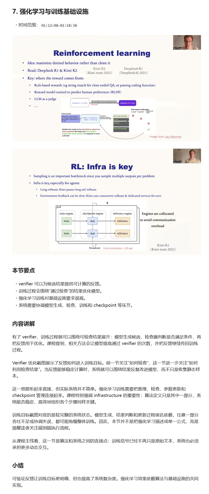
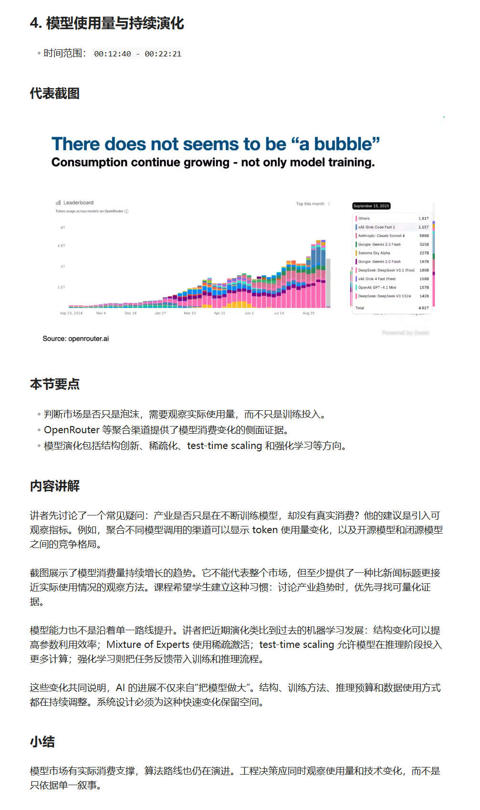

# lecture-slide-transcript-agent

A video-only workflow that turns a public lecture video URL into grounded transcript, keyframe, timeline-alignment, and handout-generation artifacts, then uses an agent-assisted Writer phase to produce a learner-facing Chinese handout.

一个 video-only 课程视频处理 workflow：输入公开视频链接，生成可追溯的字幕、关键帧、时间轴对齐和讲义生成材料，再通过 agent-assisted Writer phase 整理为面向学习者的中文讲义。

## Demo Outputs / 示例输出

The repository includes two demo runs based on public lecture videos. The polished handouts and Writer reports are stored under `examples/`, so they can be reviewed without relying on local runtime output.

仓库中提供了两份公开视频 demo。成品讲义与 Writer report 保存在 `examples/` 下，不依赖本地 `outputs/` 目录。

| Demo | Polished Chinese handout / 中文讲义 | Writer report |
| --- | --- | --- |
| Lecture 1 | [lecture_handout_zh_draft.md](examples/lecture1/lecture_handout_zh_draft.md) | [batch5B_writer_report.md](examples/lecture1/audit/batch5B_writer_report.md) |
| Lecture 2 | [lecture_handout_zh_draft.md](examples/lecture2/lecture_handout_zh_draft.md) | [batch5B_writer_report.md](examples/lecture2/audit/batch5B_writer_report.md) |

Preview of the generated handouts / 成品讲义预览：





## Overview / 项目简介

This project turns a public lecture video URL into grounded transcript, keyframe, alignment, and handout-generation artifacts. It is designed around workflow structure, evidence traceability, and validation rather than generic video summarization.

本项目把公开课程视频链接转成可追溯的字幕、关键帧、时间轴对齐和讲义生成材料。重点是 workflow、grounding 和 validation，而不是输出一份无法复查来源的普通视频摘要。

The pipeline is video-only. It does not require a pre-existing `slides.pdf`, does not render PDF slides, and does not perform slide-page alignment.

当前流程只需要视频链接，不需要预先提供 `slides.pdf`，不做 PDF slide render，也不做 slide-page alignment。

## Why This Project / 项目动机

Generic LLM video summaries can be difficult to verify: it may be unclear which transcript segment or visual evidence supports a conclusion. This project first creates auditable local artifacts, then hands grounded materials to a Writer Agent.

普通 LLM 视频总结往往难以检查来源。本项目先生成可审计的本地 artifacts，再进入 Writer Agent 阶段，让课程视频整理过程可以追溯、复查和持续迭代。

## What It Does / 功能说明

The local pipeline and the Writer phase have separate responsibilities:

- Video acquisition / 下载公开视频
- Subtitle extraction / 获取平台字幕或自动字幕
- Transcription fallback / 缺字幕时使用 Whisper 或 `faster-whisper`
- Keyframe extraction / 抽取关键帧
- Visual segment generation / 生成视觉段落
- Timeline alignment / 对齐字幕与视觉时间轴
- Content map generation / 生成内容索引
- Prompt pack generation / 生成 Writer Agent 输入材料
- Skeleton handout generation / 生成讲义骨架
- Agent-assisted Chinese handout generation / 基于 artifacts 整理中文讲义

## Workflow / 工作流

```text
video_url
  -> transcript
  -> keyframes
  -> visual segments
  -> timeline alignment
  -> content_map + prompt_pack + review_report
  -> Writer Agent
  -> Chinese handout
```

The local Python pipeline automatically produces grounded mechanical artifacts through the handout skeleton. The polished learner-facing Chinese handout is produced in a separate agent-assisted Writer phase.

本地 Python pipeline 自动生成 grounded mechanical artifacts 和讲义骨架。面向学习者的 polished 中文讲义由独立的 agent-assisted Writer phase 基于这些材料生成。

## Demo Examples / 示例讲义

[Lecture 1](examples/lecture1/) and [Lecture 2](examples/lecture2/) demonstrate the expected Chinese handout format. Each example also includes audit files and keyframes for reviewing how the handout was grounded.

[Lecture 1](examples/lecture1/) 和 [Lecture 2](examples/lecture2/) 展示了中文讲义的目标形态。示例目录同时保留 audit 文件和关键帧，便于复查生成过程。它们是 demo outputs，不代表已经完成最终人工审核。

## Usage / 使用说明

Create a YAML config for one public lecture video. The minimum required fields are:

- `video_url`: public video URL / 公开视频链接
- `run_id`: directory-safe identifier for this run / 本次运行标识
- `output_dir`: local runtime output directory / 本地运行产物目录

Use [configs/sample_config.yaml](configs/sample_config.yaml) as the reference. Local video-specific settings can be placed in a separate `configs/*.local.yaml` file and should not be committed.

请以 [configs/sample_config.yaml](configs/sample_config.yaml) 为参考。视频相关的本地配置可以写入单独的 `configs/*.local.yaml` 文件，不建议提交。

## Config Example / 配置示例

```yaml
video_url: "https://www.youtube.com/watch?v=..."
run_id: "sample_lecture"
output_dir: "outputs"

preferred_subtitle_languages: ["en", "zh-Hans", "zh", "zh-CN"]
output_language: "zh-CN"

preferred_video_height: 1080
min_video_height: 1080
allow_video_resolution_fallback: true
resolution_fallback_strategy: "best_available"

transcription_backend: "faster-whisper"
transcription_model: "base"
transcription_device: "cpu"
transcription_compute_type: "int8"

frame_interval_seconds: 10
max_keyframes: 30

content_generation_backend: "none"
content_generation_backend_mode: "skeleton"
generate_llm_prompt_pack: true
llm_prompt_pack_path: "audit/handout_prompt_pack.jsonl"
```

This is a video-only config. There is no `slides_pdf` input.

这是 video-only 配置，不包含 `slides_pdf` 输入。

## Commands / 运行命令

Install Python dependencies and make sure FFmpeg is available on `PATH`:

```bash
python -m pip install -r requirements.txt
ffmpeg -version
```

Run the pipeline in explicit stages:

```bash
# Batch 2: download video and acquire subtitles
python -m src.run_pipeline --config configs/your_config.yaml

# Batch 2.5: run transcription fallback checks and transcription when needed
python -m src.run_pipeline --config configs/your_config.yaml --transcribe-fallback-only

# Batch 3: extract full-video visual evidence and keyframes
python -m src.run_pipeline --config configs/your_config.yaml --extract-visuals-only

# Batch 4: align transcript items with visual segments
python -m src.run_pipeline --config configs/your_config.yaml --align-transcript-visuals-only

# Batch 5A: generate content map, review scaffold, prompt pack, and handout skeleton
python -m src.run_pipeline --config configs/your_config.yaml --generate-content-map-only
```

Runtime artifacts are written under `outputs/<run_id>/`. The stages are explicit so that reports and visual evidence can be inspected before moving forward.

运行产物写入 `outputs/<run_id>/`。各阶段显式执行，便于在进入下一步之前检查报告和视觉证据。

## Mechanical Artifacts / 机械产物说明

The local pipeline produces the following runtime artifacts:

| Path | Purpose / 用途 |
| --- | --- |
| `outputs/<run_id>/audit/raw_transcript.json` | Timestamped transcript and subtitle source / 带时间戳字幕与来源 |
| `outputs/<run_id>/audit/frame_report.json` | Frame extraction, resolution, and selection report / 抽帧、分辨率与筛选报告 |
| `outputs/<run_id>/audit/visual_segments.json` | Auditable visual segments and keyframe references / 可回溯视觉段落 |
| `outputs/<run_id>/audit/alignment.json` | Transcript-to-visual timeline alignment / 字幕与视觉时间轴对齐 |
| `outputs/<run_id>/audit/content_map.json` | Content units and topic grouping / 内容单元与主题归并 |
| `outputs/<run_id>/audit/review_report.md` | Engineering warnings and human-review items / 工程 warning 与人工复核项 |
| `outputs/<run_id>/audit/handout_prompt_pack.jsonl` | Grounded Writer Agent input pack / Writer Agent 输入材料 |
| `outputs/<run_id>/lecture_handout.md` | Deterministic handout skeleton / 机械讲义骨架 |
| `outputs/<run_id>/assets/keyframes/` | Extracted keyframes referenced by the handout / 讲义引用关键帧 |

`lecture_handout.md` is a skeleton, not the polished learning artifact. The Writer phase generates `lecture_handout_zh_draft.md` and `audit/batch5B_writer_report.md`.

`lecture_handout.md` 是骨架，不是最终 polished 学习产物。Writer phase 生成 `lecture_handout_zh_draft.md` 和 `audit/batch5B_writer_report.md`。

## Writer Agent Prompt / 通用 LLM 写作提示词

After Batch 5A, use the following prompt with a Writer Agent or another LLM workflow that can read the local artifacts:

Batch 5A 完成后，可以将以下 prompt 交给能够读取本地 artifacts 的 Writer Agent 或其他 LLM workflow：

```text
请基于当前 run 目录中的 grounded artifacts 生成中文课程讲义。

只读取以下输入文件：
- audit/handout_prompt_pack.jsonl
- audit/content_map.json
- lecture_handout.md
- audit/review_report.md

生成以下输出文件：
- lecture_handout_zh_draft.md
- audit/batch5B_writer_report.md

对 lecture_handout_zh_draft.md 的要求：
1. 将机械 content units 合并为 8–12 个自然章节。
2. 每章包含：时间范围、代表截图、本节要点、内容讲解、小结。
3. 不要在学习者正文中出现“来源单元”。
4. 不要沿用旧机械标题，例如“核心概念 / 讲解正文 / 关键 takeaway”。
5. 不要把工程 warning、low-confidence、review_required、alignment confidence 或 debug 信息写入学习者正文。
6. 不要编造 artifacts 之外的信息。
7. 图片只能引用已有 assets/keyframes 文件，不要生成不存在的图片路径。
8. 按知识结构组织讲义，不要把 transcript 机械拼接成逐字稿。

对 audit/batch5B_writer_report.md 的要求：
1. 记录 generation mode。
2. 记录 inputs 和 outputs。
3. 记录 known issues 和 limitations。
4. 记录 validation summary。
5. 工程 warning 和人工复核项写入 report，不要写入学习者正文。
```

## Supported Inputs / 支持范围

- The workflow depends on `yt-dlp`, so it can theoretically work with public video platforms handled by `yt-dlp`. The repository has primarily been validated with public YouTube lecture videos.
- 项目依赖 `yt-dlp`，理论上可处理 `yt-dlp` 支持的公开视频平台。当前主要验证场景是 YouTube 公开课程视频。
- Platform subtitles are preferred. When subtitles are unavailable, Whisper or optional `faster-whisper` fallback can be used depending on the local environment.
- 优先使用平台字幕。字幕不可用时，可以根据本地环境使用 Whisper 或可选的 `faster-whisper` fallback。
- The input is video-only. A pre-existing `slides.pdf` is not required.
- 输入是 video-only，不需要预先提供 `slides.pdf`。

## Resolution Policy / 分辨率策略

The default preferred video height is `1080p`. If `1080p` is unavailable, acquisition can continue with the best available fallback. A lower resolution is not a default hard failure, but the actual resolution, fallback state, and warning are recorded in reports.

默认 preferred 分辨率为 `1080p`。如果不可用，下载阶段可以使用 best available fallback。低于 `1080p` 不再默认 hard fail，但实际分辨率、fallback 状态和 warning 会写入报告。

Lower-resolution screenshots still require human review for readability and learning value. Strict mode remains available by explicitly disabling `allow_video_resolution_fallback`.

低分辨率截图仍需人工检查可读性和学习价值。显式关闭 `allow_video_resolution_fallback` 可以保留 strict mode。

## Validation Strategy / 验证策略

Valid JSON does not prove that a handout is useful. The workflow separates mechanical checks from human review.

JSON 合法不等于讲义质量通过。项目将机械检查和人工复核分开处理。

Automated checks cover download status, subtitle quality, resolution diagnostics, frame extraction, keyframe generation, timeline alignment, artifact integrity, output-path containment, and secret/private-value scans.

自动检查覆盖下载状态、字幕质量、分辨率诊断、抽帧、关键帧、时间轴对齐、artifact 完整性、输出路径边界和 secret/private-value scan。

Human review covers screenshot learning value, duplicate frames, missing visual changes, chapter organization, and learner-facing readability. The demo outputs do not claim final human approval.

人工复核覆盖截图学习价值、重复帧、遗漏画面变化、章节组织和正文可读性。Demo outputs 不代表已经完成最终人工审核。

## Current Limitations / 当前限制

- No built-in VLM backend yet. / 当前没有内置 VLM backend。
- No embedded external LLM API backend yet. / 当前没有内置 external LLM API backend。
- Final polished handouts currently depend on an agent-assisted Writer phase. / polished 中文讲义目前依赖 agent-assisted Writer phase。
- Visual quality still needs human review. / 视觉质量仍需人工复核。
- PDF export and a web viewer are not the primary outputs. / PDF export 和 web viewer 不是当前主产物。
- Video-platform behavior depends on `yt-dlp` and the local environment. / 视频平台行为依赖 `yt-dlp` 和本地环境。
- This is a research and portfolio workflow, not a production SaaS. / 这是 research / portfolio workflow，不是 production SaaS。

## Future Work / 后续方向

- VLM backend for semantic frame captioning, duplicate detection, and visual relevance scoring
- Embedded writer backend or local writer command
- Better web viewer or Markdown-to-site export
- Better frame selection and long-tail visual coverage
- More robust validation reports

以上方向是后续计划，不是当前已实现功能。

## Tech Stack / 技术栈

- Python
- `yt-dlp`
- FFmpeg
- Pillow
- PyYAML
- optional `faster-whisper`
- Markdown, JSON, JSONL, YAML

## Git And Artifact Rules / Git 与产物规则

- `outputs/` contains local runtime artifacts and should not be committed. / `outputs/` 是本地运行产物，不建议提交。
- `configs/*.local.yaml` contains local video-specific settings and should not be committed. / `configs/*.local.yaml` 是本地配置，不建议提交。
- `examples/` contains curated demo artifacts. / `examples/` 用于保存精选 demo artifacts。
- README demo links and images reference `examples/`, not local `outputs/`. / README 示例只引用 `examples/`，不引用本地 `outputs/` 展示文件。

## License / 使用许可

No license has been declared yet. Unless a license is added later, this repository is provided for learning, demonstration, and portfolio review purposes only.

当前仓库尚未声明许可证。除非后续补充 license，本仓库仅用于学习、演示和 portfolio review。
