# 课程讲义骨架：batch2_test

> 本文件是机器生成的讲义骨架草稿，尚未经过人工审核，也不是最终润色后的课程讲义。

## 课程概览

- 运行标识：`batch2_test`
- 内容来源：公开视频字幕与视频关键截图。
- 原始字幕语言：`en-j3PyPqV-e1s`
- 当前版本用于核对内容结构、时间范围和代表截图。
- 字幕摘录保留原始语言，后续需要基于可追溯证据整理为自然中文讲义。

## 章节 001

### 教学单元 001

- 时间范围：00:00:02 - 00:01:00
- 当前状态：待后续内容整理与人工复核。

字幕摘录（原文，供后续整理）：

- YANN DUBOIS: OK.
- go through all the slides.
- is related to OpenAI here.

### 教学单元 002

- 时间范围：00:01:00 - 00:04:58
- 当前状态：待后续内容整理与人工复核。

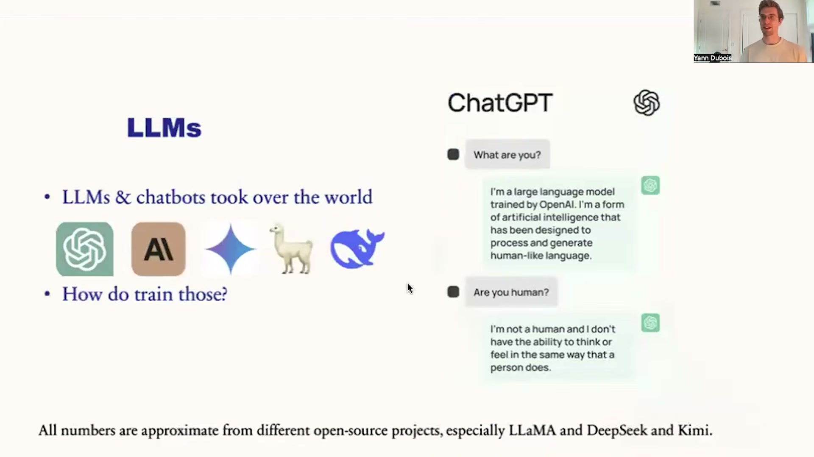

字幕摘录（原文，供后续整理）：

- Great.
- trained, but this is the second part
- because it can follow instructions

### 教学单元 003

- 时间范围：00:04:58 - 00:08:58
- 当前状态：待后续内容整理与人工复核。

字幕摘录（原文，供后续整理）：

- that are given by humans.
- for example, removing the test in your environment
- I've done also a PhD.

### 教学单元 004

- 时间范围：00:08:58 - 00:11:09
- 当前状态：待后续内容整理与人工复核。

字幕摘录（原文，供后续整理）：

- That's what I was focused on until around 2023.
- so that's why I will not be talking about that.
- And then the second part is fine-tuning.

## 章节 002

### 教学单元 005

- 时间范围：00:11:09 - 00:14:18
- 当前状态：待后续内容整理与人工复核。

字幕摘录（原文，供后续整理）：

- So we will not be talking about it, but just to mention it here,
- like predicting what's the next word that you will predict.
- And pretraining has really been the key

### 教学单元 006

- 时间范围：00:14:18 - 00:17:10
- 当前状态：待后续内容整理与人工复核。

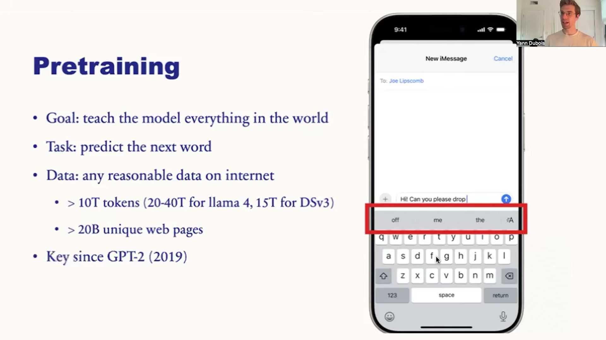

字幕摘录（原文，供后续整理）：

- since GPT-2 in 2019, that mostly showed the world what
- these words that computers don't understand to numbers
- So the last two steps, this is not super important.

### 教学单元 007

- 时间范围：00:17:10 - 00:21:08
- 当前状态：待后续内容整理与人工复核。

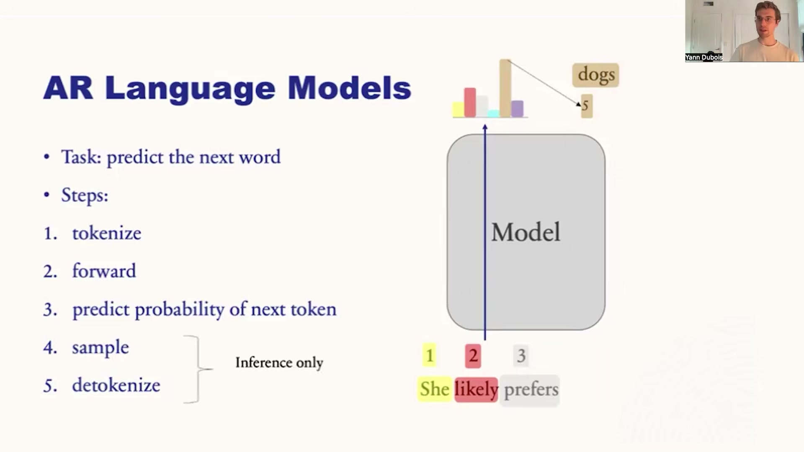

字幕摘录（原文，供后续整理）：

- But last two steps are only happening at inference time.
- that that word appeared after "The grass is"
- would have with this very simple statistical language model.

## 章节 003

### 教学单元 008

- 时间范围：00:21:08 - 00:24:50
- 当前状态：待后续内容整理与人工复核。

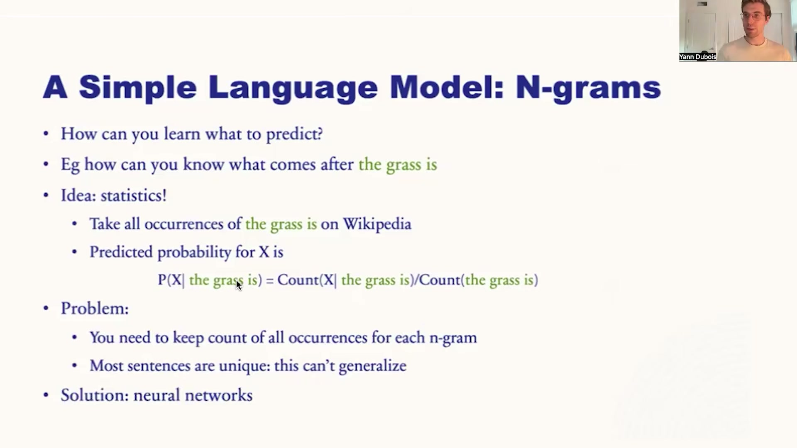

字幕摘录（原文，供后续整理）：

- And so the solution is very simple.
- It does some munging.
- That is a 20,000 dimensional weight.

### 教学单元 009

- 时间范围：00:24:50 - 00:26:00
- 当前状态：待后续内容整理与人工复核。

字幕摘录（原文，供后续整理）：

- So once you have this, you will just pass it through a softmax.
- Let's say that the real word comes from here.
- OK.

### 教学单元 010

- 时间范围：00:26:00 - 00:27:38
- 当前状态：待后续内容整理与人工复核。

字幕摘录（原文，供后续整理）：

- So now that we talked about the method, let's talk
- You first download all of internet.
- And here, you will find the text that says, blah, blah, blah,

### 教学单元 011

- 时间范围：00:27:38 - 00:28:00
- 当前状态：待后续内容整理与人工复核。

字幕摘录（原文，供后续整理）：

- blah, or here, paragraph, one of the best and most rewarding
- about rewarding features.
- Anyways, it seems to be kind of an ad.

## 章节 004

### 教学单元 012

- 时间范围：00:28:00 - 00:31:55
- 当前状态：待后续内容整理与人工复核。

字幕摘录（原文，供后续整理）：

- So anyways, this is a random website
- that are duplicated.
- And then one you train that classifier,

### 教学单元 013

- 时间范围：00:31:55 - 00:33:10
- 当前状态：待后续内容整理与人工复核。

字幕摘录（原文，供后续整理）：

- you basically have a classifier that essentially predicts
- And then you might want to reweigh different domains.
- will try to predict what to do at larger scale.

### 教学单元 014

- 时间范围：00:33:10 - 00:33:58
- 当前状态：待后续内容整理与人工复核。

字幕摘录（原文，供后续整理）：

- Great.
- of high quality data.
- our model on that high-quality data, such as the model

### 教学单元 015

- 时间范围：00:33:58 - 00:37:58
- 当前状态：待后续内容整理与人工复核。

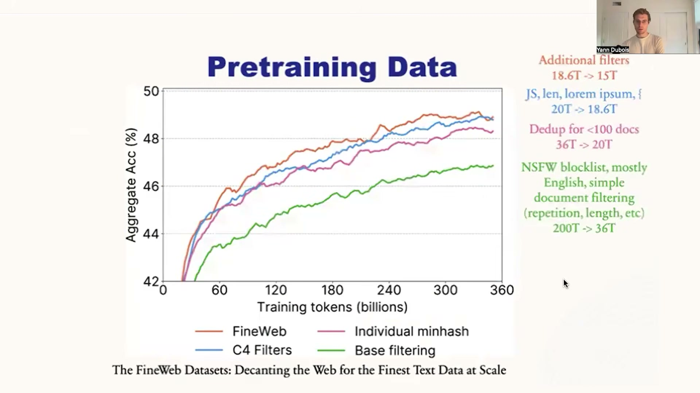

字幕摘录（原文，供后续整理）：

- lends to really be as good as possible.
- Again, that's because you're basically not forcing your model
- representative of how many people speak that language.

## 章节 005

### 教学单元 016

- 时间范围：00:37:58 - 00:39:09
- 当前状态：待后续内容整理与人工复核。

字幕摘录（原文，供后续整理）：

- Some other type of things we do during training
- So usually, what you do during training
- to answer questions when you ask a question

### 教学单元 017

- 时间范围：00:39:09 - 00:41:09
- 当前状态：待后续内容整理与人工复核。

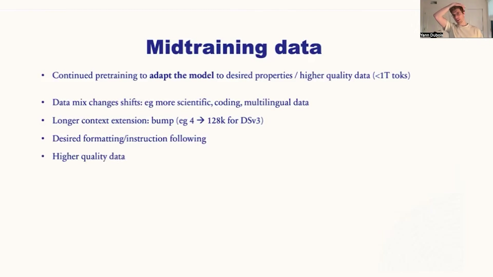

字幕摘录（原文，供后续整理）：

- or to write in a very specific chatty way.
- I mean, these are huge scales of data that we're talking about,
- So FineWeb is the one we talked about before

### 教学单元 018

- 时间范围：00:41:09 - 00:42:19
- 当前状态：待后续内容整理与人工复核。

字幕摘录（原文，供后续整理）：

- with 15 trillion tokens.
- and does also some better filtering.
- Because if the model is bigger, you need to spend more compute.

### 教学单元 019

- 时间范围：00:42:19 - 00:45:08
- 当前状态：待后续内容整理与人工复核。

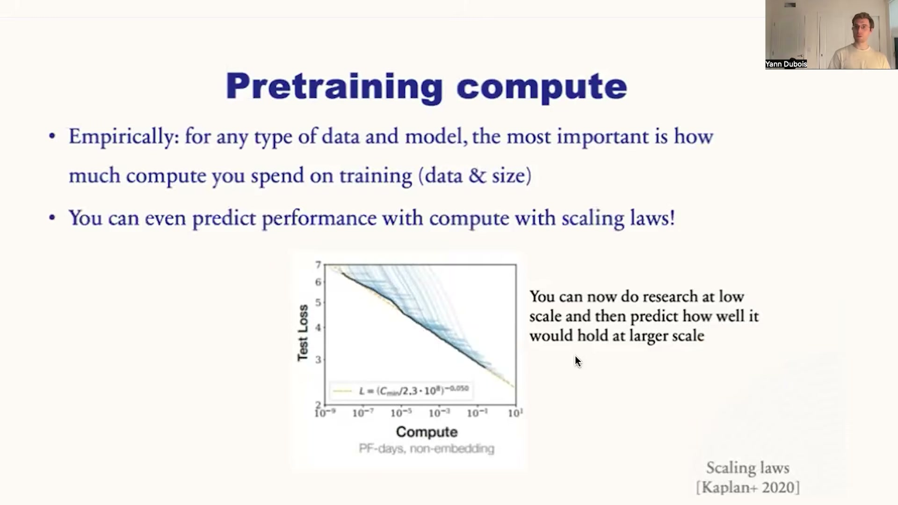

字幕摘录（原文，供后续整理）：

- And what is very nice is that you can actually
- yeah, it could have been differently.
- And then you can plot the scaling law,

## 章节 006

### 教学单元 020

- 时间范围：00:45:08 - 00:47:30
- 当前状态：待后续内容整理与人工复核。

字幕摘录（原文，供后续整理）：

- extrapolate how well you will be performing at larger scale,
- be that the constant is better for one of the architectures,
- So that's this optimal resource allocation.

### 教学单元 021

- 时间范围：00:47:30 - 00:50:09
- 当前状态：待后续内容整理与人工复核。

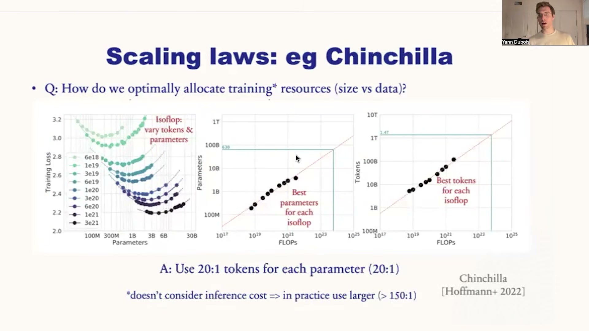

字幕摘录（原文，供后续整理）：

- One thing to note, you will hear often about chinchilla,
- the big researcher of reinforcement learning.
- has driven a lot of how the community has

### 教学单元 022

- 时间范围：00:50:09 - 00:52:48
- 当前状态：待后续内容整理与人工复核。

字幕摘录（原文，供后续整理）：

- been thinking in the last, I would say, three or four years.
- So this is around 2 times less than executive order.
- could see how in 2, 3, 4 generations, that

### 教学单元 023

- 时间范围：00:52:48 - 00:53:40
- 当前状态：待后续内容整理与人工复核。

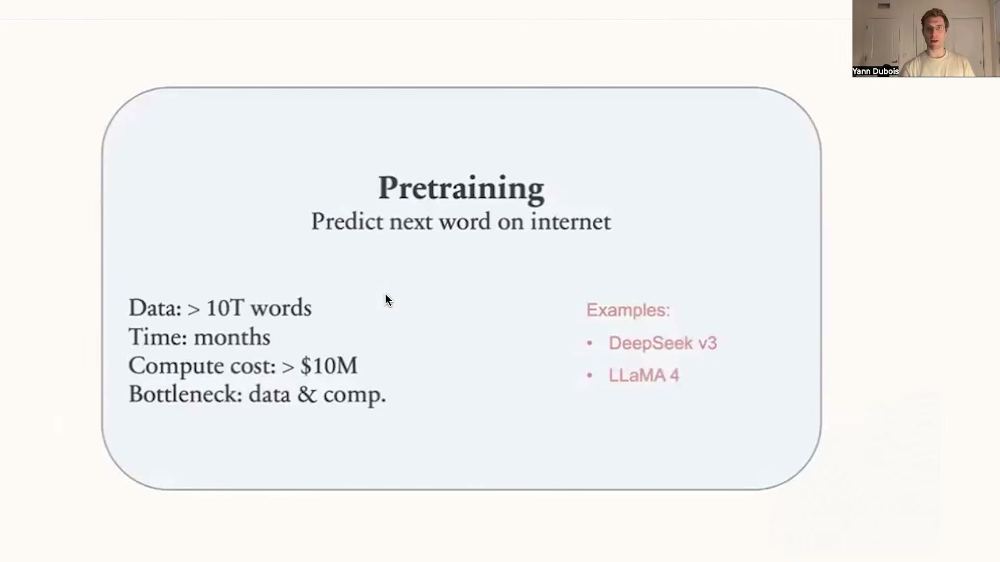

字幕摘录（原文，供后续整理）：

- will become a real issue in terms of carbon emitted.
- right now.
- So why do we want to do post-training?

## 章节 007

### 教学单元 024

- 时间范围：00:53:40 - 00:55:29
- 当前状态：待后续内容整理与人工复核。

字幕摘录（原文，供后续整理）：

- Well, language modeling, so what we do during pretraining,
- this is just about language modeling
- points, because the model already knows everything.

### 教学单元 025

- 时间范围：00:55:29 - 00:57:21
- 当前状态：待后续内容整理与人工复核。

字幕摘录（原文，供后续整理）：

- So it just needs to learn, basically, how to act
- so things like math competitions or coding test cases.
- answer than if you gave me like a week to answer the question.

### 教学单元 026

- 时间范围：00:57:21 - 00:59:09
- 当前状态：待后续内容整理与人工复核。

字幕摘录（原文，供后续整理）：

- So the goal was test time scaling.
- know what you want to provide to these models.
- but it's not really what you want, as we said.

### 教学单元 027

- 时间范围：00:59:09 - 01:00:21
- 当前状态：待后续内容整理与人工复核。

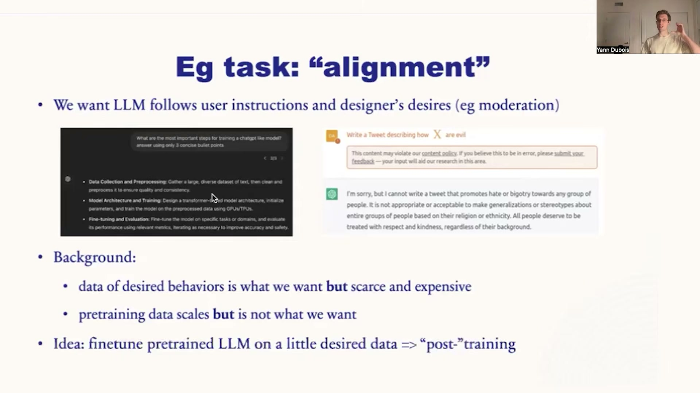

字幕摘录（原文，供后续整理）：

- So the idea is that, given that one is scalable,
- So the idea is, again, just to fine-tune the LLM
- There are many different ways-- one is just to ask humans.

## 章节 008

### 教学单元 028

- 时间范围：01:00:21 - 01:01:18
- 当前状态：待后续内容整理与人工复核。

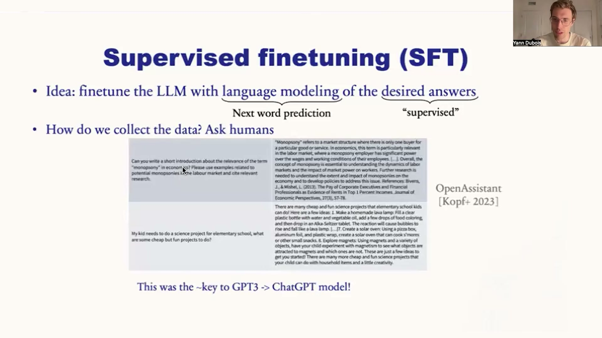

字幕摘录（原文，供后续整理）：

- And this was the key from GPT 3 to ChatGPT, the initial ChatGPT
- is to use an LLM to scale data collection.
- with the answer that is given by the OpenAI models.

### 教学单元 029

- 时间范围：01:01:18 - 01:03:09
- 当前状态：待后续内容整理与人工复核。

字幕摘录（原文，供后续整理）：

- So we did that on 52,000 answers.
- So we talked about two ways right now.
- were treating this first top open source model.

### 教学单元 030

- 时间范围：01:03:09 - 01:05:10
- 当前状态：待后续内容整理与人工复核。

字幕摘录（原文，供后续整理）：

- The idea is that you can use rejection sampling
- So what do we learn during SFT?
- basically, given that this works pretty well,

### 教学单元 031

- 时间范围：01:05:10 - 01:05:41
- 当前状态：待后续内容整理与人工复核。

字幕摘录（原文，供后续整理）：

- and you might want to do that first before doing
- but I just want to you a sense of how complicated it can be.
- So basically, teaching the model to use tools.

## 章节 009

### 教学单元 032

- 时间范围：01:05:41 - 01:07:29
- 当前状态：待后续内容整理与人工复核。

字幕摘录（原文，供后续整理）：

- And what they did is pretty complicated with some LLM that
- simulating LLM.
- So yeah, the idea is that you don't

### 教学单元 033

- 时间范围：01:07:29 - 01:08:08
- 当前状态：待后续内容整理与人工复核。

字幕摘录（原文，供后续整理）：

- need to train on much data for SFT
- how to write in bullet points or how to use emojis in your model.
- seen during pretraining or very little, and then

### 教学单元 034

- 时间范围：01:08:08 - 01:10:09
- 当前状态：待后续内容整理与人工复核。

字幕摘录（原文，供后续整理）：

- you need much more data.
- And the second thing is that you will actually
- to make up plausible sounding references.

### 教学单元 035

- 时间范围：01:10:09 - 01:12:08
- 当前状态：待后续内容整理与人工复核。

字幕摘录（原文，供后续整理）：

- So yeah.
- some test cases for coding.
- If it's not Python, then it's also wrong.

## 章节 010

### 教学单元 036

- 时间范围：01:12:08 - 01:13:18
- 当前状态：待后续内容整理与人工复核。

字幕摘录（原文，供后续整理）：

- And then it might check like if you pass some test cases,
- that we just talked about.
- where it tries to optimize the number of times

### 教学单元 037

- 时间范围：01:13:18 - 01:15:21
- 当前状态：待后续内容整理与人工复核。

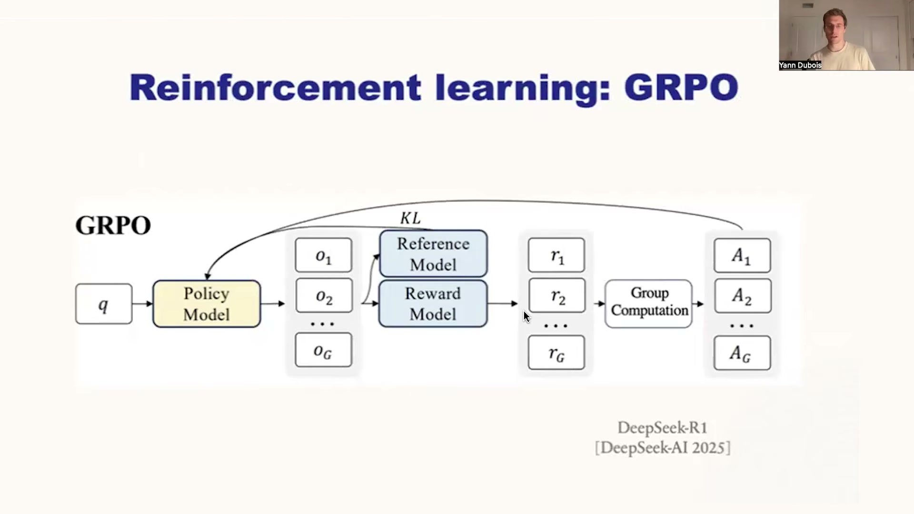

字幕摘录（原文，供后续整理）：

- that your verifier says you're correct.
- And then you basically backpropagate
- And Kimi K1.5 and Kimi K2 use a similar loss.

### 教学单元 038

- 时间范围：01:15:21 - 01:15:30
- 当前状态：待后续内容整理与人工复核。

字幕摘录（原文，供后续整理）：

- OK.
- that in reinforcement learning, infra is really key,
- it's really, really important.

### 教学单元 039

- 时间范围：01:15:30 - 01:18:38
- 当前状态：待后续内容整理与人工复核。

字幕摘录（原文，供后续整理）：

- And the reason why is because, as you saw,
- Then they have a checkpoint engine
- It's an SFT model.

## 章节 011

### 教学单元 040

- 时间范围：01:18:38 - 01:20:11
- 当前状态：待后续内容整理与人工复核。

字幕摘录（原文，供后续整理）：

- And then you ask some labelers to select which of the two
- how a pretraining model performs for summarization,
- than the pretraining model.

### 教学单元 041

- 时间范围：01:20:11 - 01:21:01
- 当前状态：待后续内容整理与人工复核。

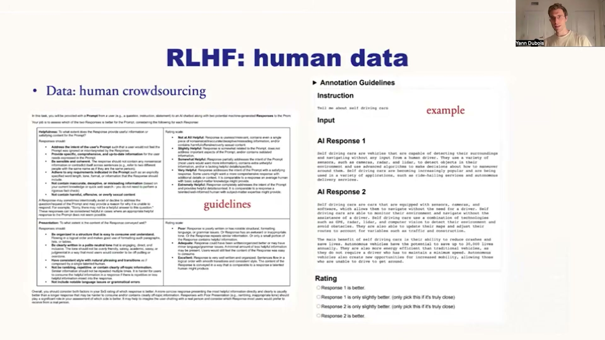

字幕摘录（原文，供后续整理）：

- OK.
- Yeah, a lot of work that goes into collecting data.
- they will usually focus on the form or the style, things

### 教学单元 042

- 时间范围：01:21:01 - 01:23:00
- 当前状态：待后续内容整理与人工复核。

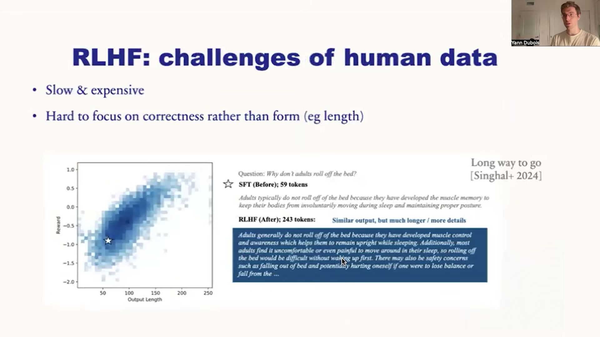

字幕摘录（原文，供后续整理）：

- like lengths.
- shows, on the x-axis, the amount of dollars
- OK.

### 教学单元 043

- 时间范围：01:23:00 - 01:23:09
- 当前状态：待后续内容整理与人工复核。

字幕摘录（原文，供后续整理）：

- And then evaluation.
- So I'll talk really briefly about that.
- But there's basically two types of evaluation--

## 章节 012

### 教学单元 044

- 时间范围：01:23:09 - 01:25:19
- 当前状态：待后续内容整理与人工复核。

字幕摘录（原文，供后续整理）：

- closed-ended evaluation and open-ended evaluation.
- This is very important for practical use cases.
- Two, it might have train test contamination.

### 教学单元 045

- 时间范围：01:25:19 - 01:26:31
- 当前状态：待后续内容整理与人工复核。

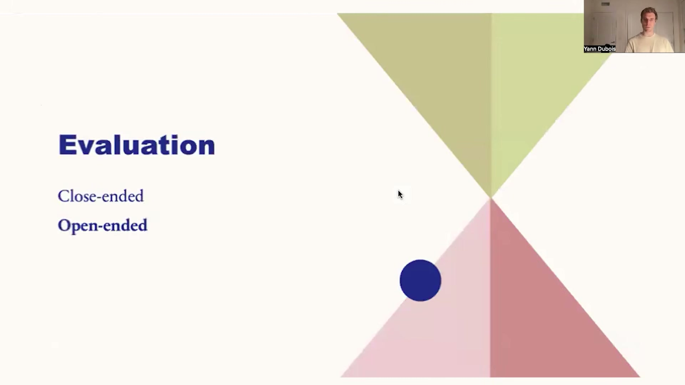

字幕摘录（原文，供后续整理）：

- So if your model was trained on the eval, because right now,
- like ChatGPT or an LLM?
- the correct answer.

### 教学单元 046

- 时间范围：01:26:31 - 01:27:30
- 当前状态：待后续内容整理与人工复核。

字幕摘录（原文，供后续整理）：

- So that makes it hard.
- did, where you basically ask humans to blindly interact
- because there's no gold answer.

### 教学单元 047

- 时间范围：01:27:30 - 01:28:59
- 当前状态：待后续内容整理与人工复核。

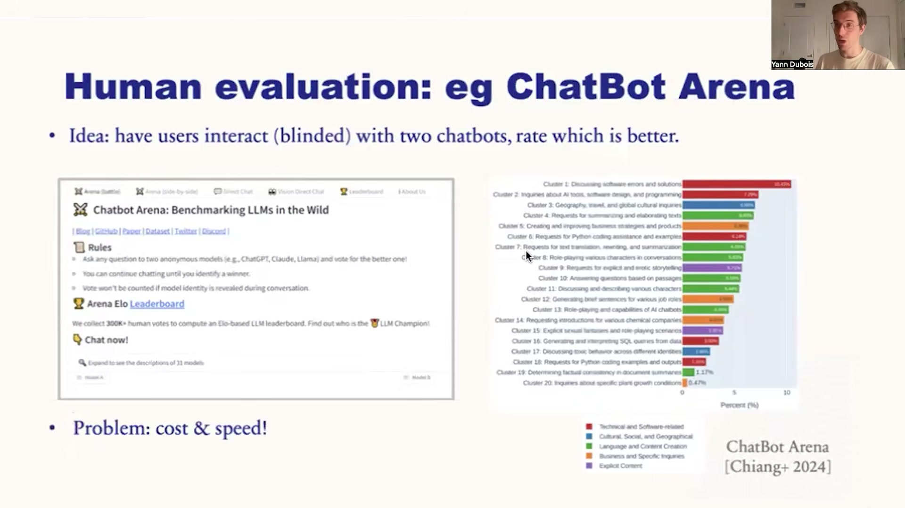

字幕摘录（原文，供后续整理）：

- And the problem with this is that using humans
- And then you will just look at the number of times
- Great.

## 章节 013

### 教学单元 048

- 时间范围：01:28:59 - 01:30:19
- 当前状态：待后续内容整理与人工复核。

字幕摘录（原文，供后续整理）：

- OK.
- There are a few reasons why we can do that.
- So yeah, you need to do some good resource allocation,

### 教学单元 049

- 时间范围：01:30:19 - 01:34:14
- 当前状态：待后续内容整理与人工复核。

字幕摘录（原文，供后续整理）：

- and you need to optimize your pipelines.
- And you see that for matrix multiplication
- that is required for matrix multiplication.

### 教学单元 050

- 时间范围：01:34:14 - 01:35:39
- 当前状态：待后续内容整理与人工复核。

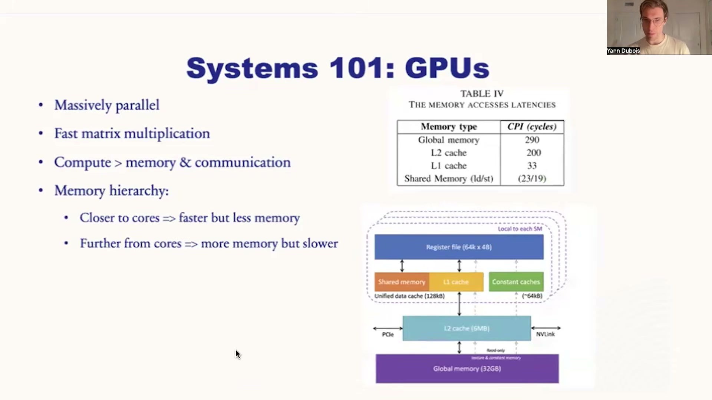

字幕摘录（原文，供后续整理）：

- But in terms of runtime speed, it's still a majority,
- So the closer you are to the cores,
- from your registers and your process.

### 教学单元 051

- 时间范围：01:35:39 - 01:39:00
- 当前状态：待后续内容整理与人工复核。

字幕摘录（原文，供后续整理）：

- So yeah, this memory hierarchy and the metric
- consumption.
- And your gradients will be stored in bf16,

## 章节 014

### 教学单元 052

- 时间范围：01:39:00 - 01:41:09
- 当前状态：待后续内容整理与人工复核。

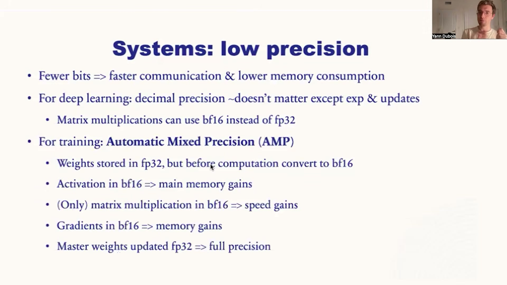

字幕摘录（原文，供后续整理）：

- so you'll have memory gains.
- have a lot of this communication between global and memory.
- so there are fewer slow things here.

### 教学单元 053

- 时间范围：01:41:09 - 01:44:59
- 当前状态：待后续内容整理与人工复核。

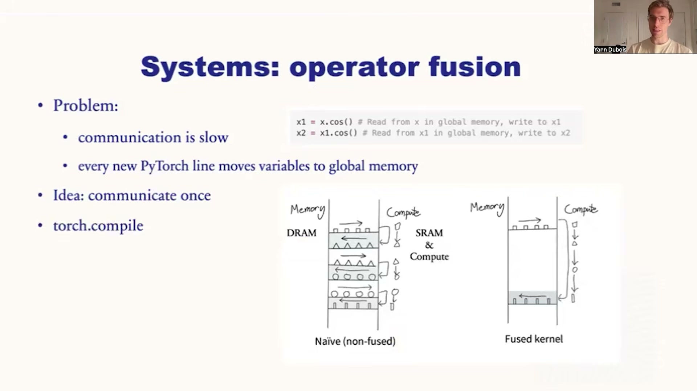

字幕摘录（原文，供后续整理）：

- And this is basically what torch.compile
- I'm going to have one thread that instead of working
- in a single thread, such that with less data,

### 教学单元 054

- 时间范围：01:44:59 - 01:45:09
- 当前状态：待后续内容整理与人工复核。

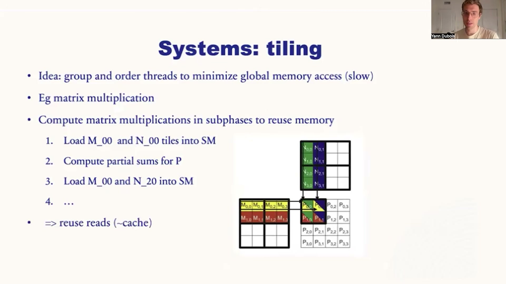

字幕摘录（原文，供后续整理）：

- you can do more computation.
- So you can reuse the reads and basically have access

### 教学单元 055

- 时间范围：01:45:09 - 01:47:52
- 当前状态：待后续内容整理与人工复核。

字幕摘录（原文，供后续整理）：

- to your cache.
- I do want to maybe briefly talk about parallelization.
- You actually need 16 times P gigabytes of DRAM.

## 章节 015

### 教学单元 056

- 时间范围：01:47:52 - 01:50:49
- 当前状态：待后续内容整理与人工复核。

字幕摘录（原文，供后续整理）：

- So the reason is that you need 4P, so four bytes, because here,
- on your data set.
- The negative aspect is that here, you

### 教学单元 057

- 时间范围：01:50:49 - 01:51:29
- 当前状态：待后续内容整理与人工复核。

字幕摘录（原文，供后续整理）：

- have literally no memory gains, because now,
- to have 112 gigabytes of memory on every GPUs,
- a subset of weights.

### 教学单元 058

- 时间范围：01:51:32 - 01:54:56
- 当前状态：待后续内容整理与人工复核。

字幕摘录（原文，供后续整理）：

- Yeah, update a subset of weights and hold the subset of weights.
- So basically, as I said, I assume,
- So this is the idea that instead of having every GPU hold

### 教学单元 059

- 时间范围：01:54:56 - 01:56:52
- 当前状态：待后续内容整理与人工复核。

字幕摘录（原文，供后续整理）：

- a different layer, you can have split matrices,
- is that models are really huge.
- So here, you have a dense model that basically is a little bit

## 章节 016

### 教学单元 060

- 时间范围：01:56:52 - 01:58:20
- 当前状态：待后续内容整理与人工复核。

字幕摘录（原文，供后续整理）：

- too much into the weeds, but if you know about transformers
- was tiling, so like ordering of your operations.
- And yeah, good luck for the rest of the class.

## 后续整理说明

当前文件仅提供可追溯的章节骨架、截图和有限字幕摘录。自然中文表达、概念归并和示例整理将在后续阶段完成。
