# 大语言模型训练：从预训练到后训练与系统效率

> 本讲义根据课程视频字幕、关键截图与时间轴整理而成，保留时间范围，便于回看原视频对应片段。

## 课程概览

本课程从大语言模型的完整训练流程出发，先解释预训练如何把“预测下一个词”变成可规模化的学习任务，再讨论数据清洗、质量筛选和 scaling law。随后，课程转向 post-training：如何通过 SFT、合成数据、rejection sampling、工具使用、verifier 和偏好反馈，让模型更符合实际使用需求。最后，课程把视角扩展到推理效率、内存层级和并行策略，说明模型能力背后还有大量系统工程问题。

---

## 1. 课程引入：从预训练走向后训练

- 时间范围：`00:00:02–00:11:09`

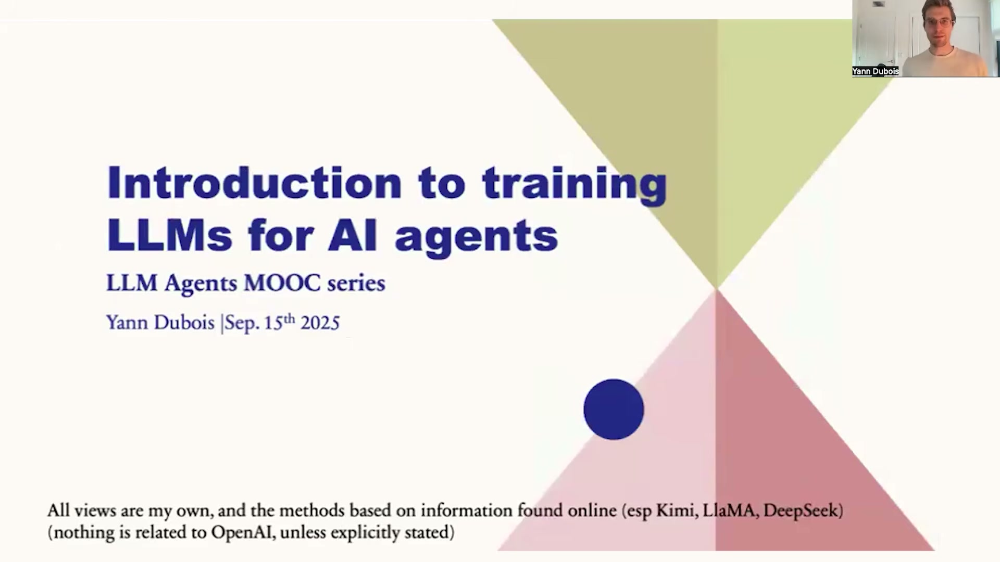

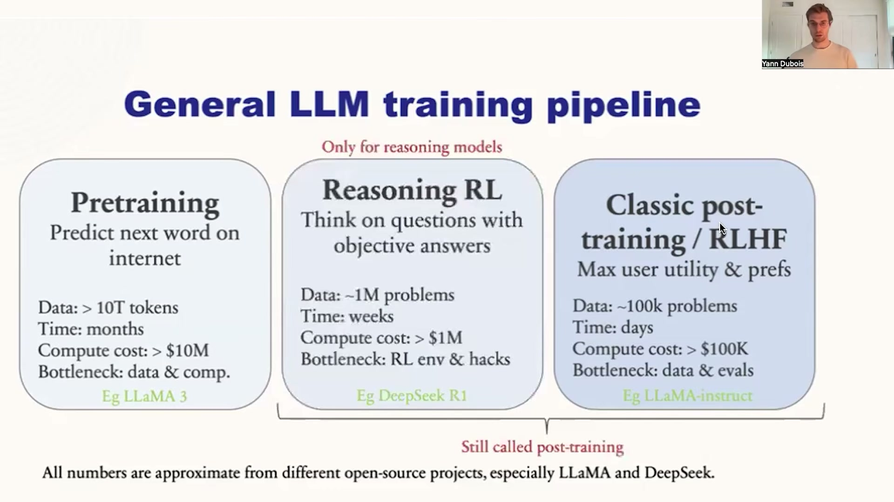

### 本节要点

- 预训练与 post-training 是相互衔接但目标不同的阶段。
- 预训练建立基础语言能力；后续 fine-tuning 让模型更好地遵循人类给出的指令。
- 课程重点不只是“模型训练过了”，而是模型如何从语言建模转向可用的交互行为。

### 内容讲解

课程开头先建立整体视角：大语言模型并不是经过一次训练就自然成为可用助手。预训练解决的是基础能力问题，模型通过大规模文本学习语言中的规律；post-training 则进一步处理使用方式，让模型能够更贴近人类指令和任务要求。

开头两张截图对应课程的引入与整体结构。它们提示读者，后续内容不是围绕某一个孤立算法展开，而是沿着一条完整路径推进：先理解模型如何从文本中学习，再讨论如何让模型完成更具体的任务，最后回到承载这些训练过程的系统工程。

这一划分也决定了后续内容的组织方式。前半部分关注语言建模、数据和规模，后半部分关注 fine-tuning、反馈、评估以及系统实现。理解这条主线，比孤立记忆某一种训练方法更重要。

从学习角度看，可以把本课程当作一张路线图。预训练回答“模型如何获得基础能力”，post-training 回答“如何把能力转化为可用行为”，系统章节则回答“这些过程如何在真实计算资源上运行”。后续每一节都可以放回这三个问题中理解。

### 小结

大语言模型训练应被理解为分阶段流程：先获得通用语言能力，再通过后训练把能力转化为更符合使用需求的行为。

---

## 2. 语言模型与预训练基本流程

- 时间范围：`00:11:09–00:26:00`

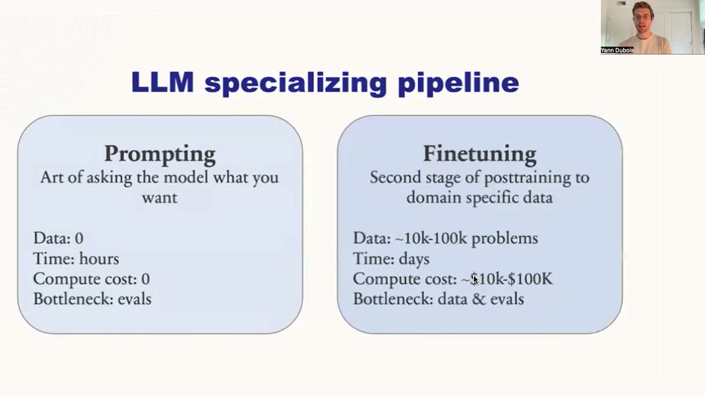

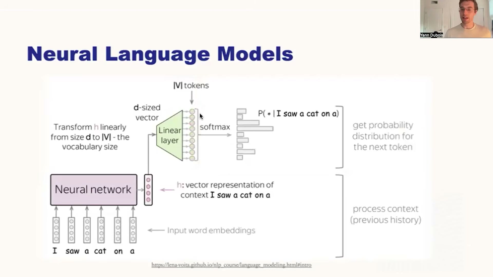

### 本节要点

- 预训练的基础任务是预测下一个词或 token。
- 文本需要被转换成模型可处理的数字表示。
- 模型内部会形成高维权重或表示，并通过 softmax 得到候选输出的概率分布。
- 部分步骤属于 inference 阶段，而不是训练阶段。

### 内容讲解

课程用一个直观问题引入语言建模：给定前文，模型要判断接下来最可能出现什么。即使从简单统计模型出发，也可以观察“某个词经常出现在某段上下文之后”的规律。现代语言模型把这个任务扩展到更大的参数空间和更丰富的上下文中。

文本本身不能直接进入计算过程，因此需要先转换为数字表示。课程随后展示了高维权重、向量处理和 softmax 输出的基本思路：模型产生一组分数，再把它们转化为概率分布，用于选择或评估下一个输出。

本节的两张截图分别对应预训练流程和输出分布。第一张帮助读者把文本处理、模型计算和 inference 阶段区分开来；第二张则把抽象的“预测”落到一个更具体的结果上：模型并不是直接给出唯一答案，而是先形成多个候选结果的概率分布。

这也解释了为什么“预测下一个 token”可以成为大规模学习任务。训练材料中的文本本身就提供了目标，模型可以不断比较自己的预测和真实后续内容。随着数据量和模型规模扩大，这个简单目标能够驱动模型学习更丰富的语言规律。

理解这里的关键，不是死记每个局部步骤，而是掌握统一框架：输入文本被编码，模型计算候选结果，输出分布用于完成下一步预测。

### 小结

预训练把语言学习转化为可重复执行的预测任务；从文本编码到概率分布，所有复杂模型都围绕这一基本目标展开。

---

## 3. 预训练数据：收集、去重与质量控制

- 时间范围：`00:26:00–00:37:58`

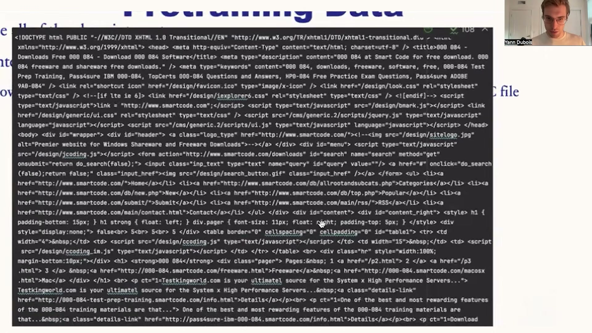

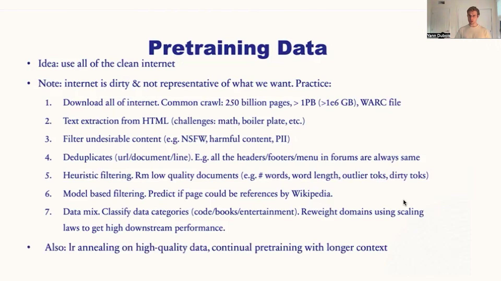

### 本节要点

- 预训练数据来自大规模互联网文本，但原始网页并不等于可直接使用的数据。
- 数据处理需要面对重复内容、广告或低质量文本。
- 可以训练质量分类器，并对不同数据域进行重新加权。
- 数据质量和覆盖范围都需要权衡。

### 内容讲解

获得互联网文本只是起点。课程通过网页示例说明，原始材料中会混入重复段落、广告式内容和质量不稳定的文本。如果不做筛选，模型会把计算资源消耗在价值有限的样本上。

网页数据示例截图把这个问题具体化：同一页面里可能同时出现有用正文、重复片段和与学习目标关系不大的文本。面对海量数据，不能依赖逐条人工处理，而需要建立可规模化的数据清洗流程。

因此，数据流程不仅包括下载，还包括去重、质量判断和数据域权重调整。课程提到，可以训练分类器来预测数据质量，再依据任务目标调整不同来源的占比。筛选并不意味着简单追求单一风格：如果数据分布过于狭窄，也可能削弱模型对不同语言或表达方式的覆盖。

后续高质量数据截图可以和前面的网页示例对照阅读：前者代表筛选目标，后者代表原始输入。两者之间并不是一次简单删除操作，而是包含去重、分类和重新加权的一系列决策。

这一部分强调了一个工程事实：数据处理不是训练前的附属工作，而是模型效果的重要组成部分。

### 小结

预训练数据的价值不由数量单独决定。收集、去重、质量筛选和域权重调整共同决定了模型实际学到什么。

---

## 4. 数据规模、模型规模与 scaling law

- 时间范围：`00:37:58–00:53:41`

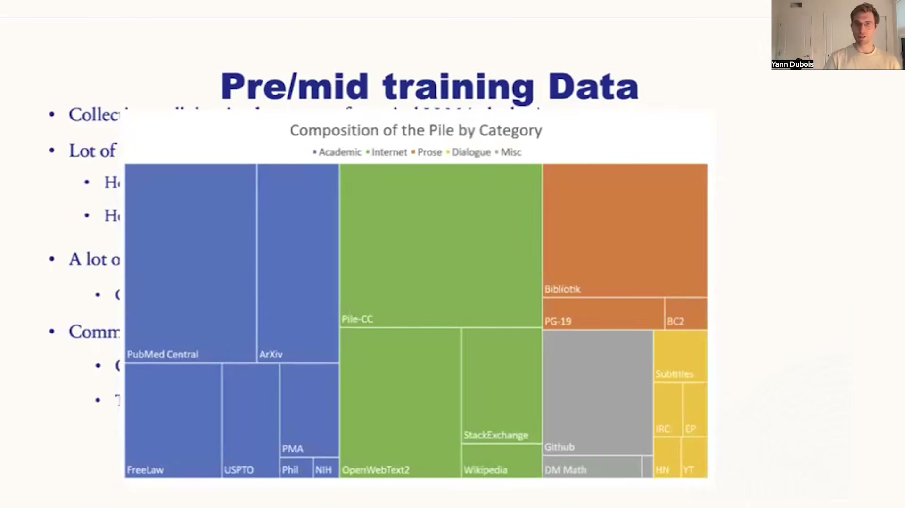

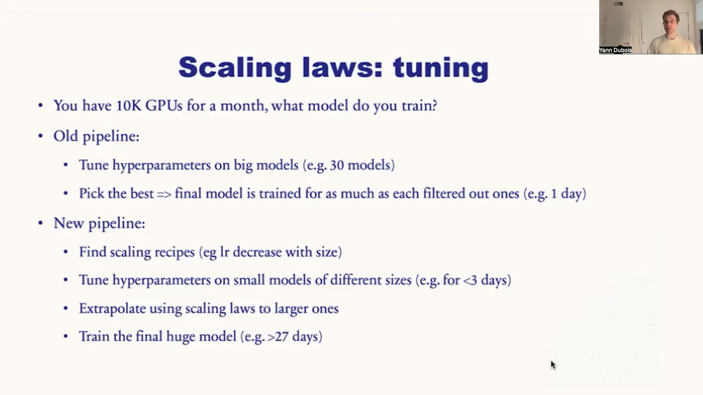

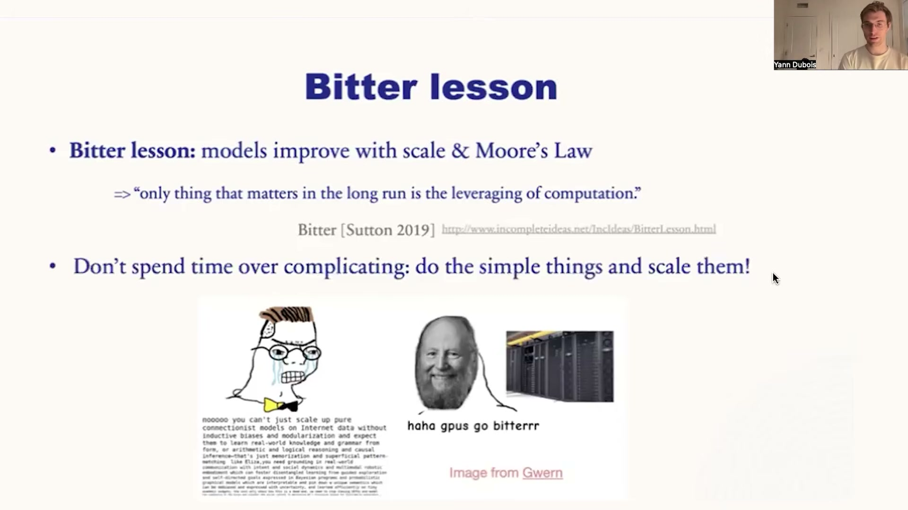

### 本节要点

- 训练数据规模可以非常大，课程以 FineWeb 等数据处理案例说明这一点。
- 更大的模型通常需要匹配更多计算资源。
- scaling law 用于观察规模变化与性能变化之间的趋势，并支持更大规模训练前的估算。
- 资源分配不仅影响性能，也会影响成本和能耗。

### 内容讲解

课程从数据处理继续推进到规模问题。数据集可以达到非常大的 token 数量，同时还需要进一步过滤。模型变大以后，计算预算也必须随之调整；仅增加某一个维度，并不一定得到最合适的结果。

本节的截图从数据规模逐步推进到扩展规律和资源权衡。阅读时可以注意这条因果链：更大规模的数据和模型带来新的性能空间，但也会增加训练成本；成本增加以后，就需要通过较小实验观察趋势，而不是直接盲目放大训练规模。

scaling law 的作用，是用较小规模实验观察趋势，再估算更大规模训练可能达到的表现。课程进一步讨论了 optimal resource allocation：在模型规模、数据规模和计算预算之间寻找更合理的组合。这里的重点不是记住单一结论，而是把训练看成受多项资源共同约束的系统。

这类分析能够帮助团队在真正投入大规模训练之前做判断。一个训练方案是否值得继续扩展，不仅取决于预期性能，还取决于新增计算资源能否带来相称收益。课程在这里把模型研究和资源规划连接起来。

课程也提醒，扩展并非没有代价。随着规模继续增加，资源消耗和能耗会成为更现实的问题。

### 小结

模型扩展不是单变量竞赛。数据、参数、计算预算和能耗需要一起纳入决策，scaling law 是做这种判断的重要工具。

---

## 5. Post-training 与 SFT：让模型学会按要求行动

- 时间范围：`00:53:41–01:05:10`

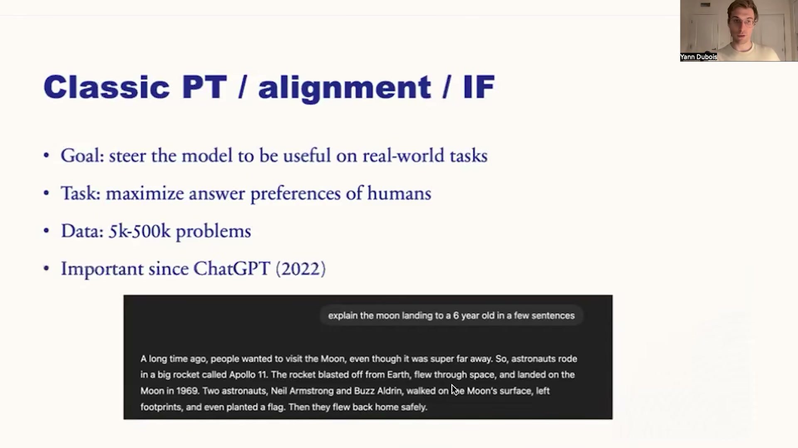

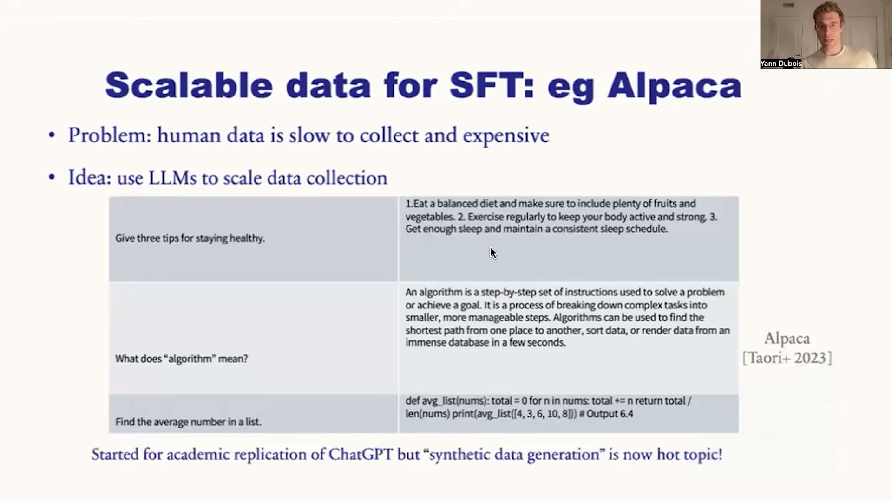

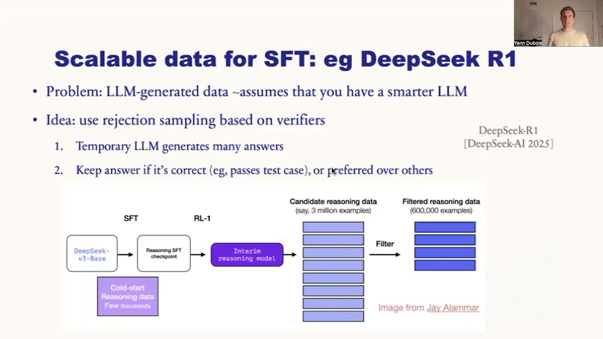

### 本节要点

- 预训练主要学习语言建模，不会自动得到理想的任务行为。
- post-training 更关注模型“如何行动”和“如何回答”。
- SFT 可以使用人工答案，也可以使用模型生成的数据扩展收集规模。
- rejection sampling 用于从多个候选中筛选更合适的训练样本。
- 某些任务还可以利用 test-time scaling，让模型在回答前投入更多计算。

### 内容讲解

语言建模能力强，并不等于模型天然知道用户希望它怎样回答。课程把 post-training 的动机概括为行为塑造：模型可能已经具备相关基础能力，但仍需要学习任务格式、回答方式和执行要求。

后训练动机截图可以用来理解这一转折。预训练让模型能够继续文本，但实际使用通常要求模型遵循指令、控制回答形式，或者在约束条件下完成任务。post-training 关注的正是从“会生成”到“会按要求完成任务”的变化。

SFT 是其中一个核心步骤。训练数据可以来自人工回答，也可以借助模型生成来扩大规模。课程还介绍了 rejection sampling：先生成多个候选，再筛选更适合用于训练的结果。这个流程把“数据收集”从一次性编写答案扩展为生成、判断和筛选的组合过程。

指令数据和 rejection sampling 两张截图展示了两个相互衔接的环节。前者说明模型需要看到什么样的任务示例，后者说明样本并不一定要直接接受：可以生成多个版本，再按照一定标准留下更合适的候选。这样，数据构建本身也成为可以迭代优化的过程。

对于数学竞赛、代码测试等能够检查结果的任务，回答质量还可以通过更多推理尝试得到改善。课程将这一方向与 test-time scaling 联系起来：推理阶段投入的计算量也会影响结果。

### 小结

post-training 的核心不是重新做一次预训练，而是把已有能力整理成更符合任务要求的行为。SFT、合成数据和筛选机制是这一过程的重要工具。

---

## 6. 工具使用、代码任务与 verifier

- 时间范围：`01:05:10–01:12:08`

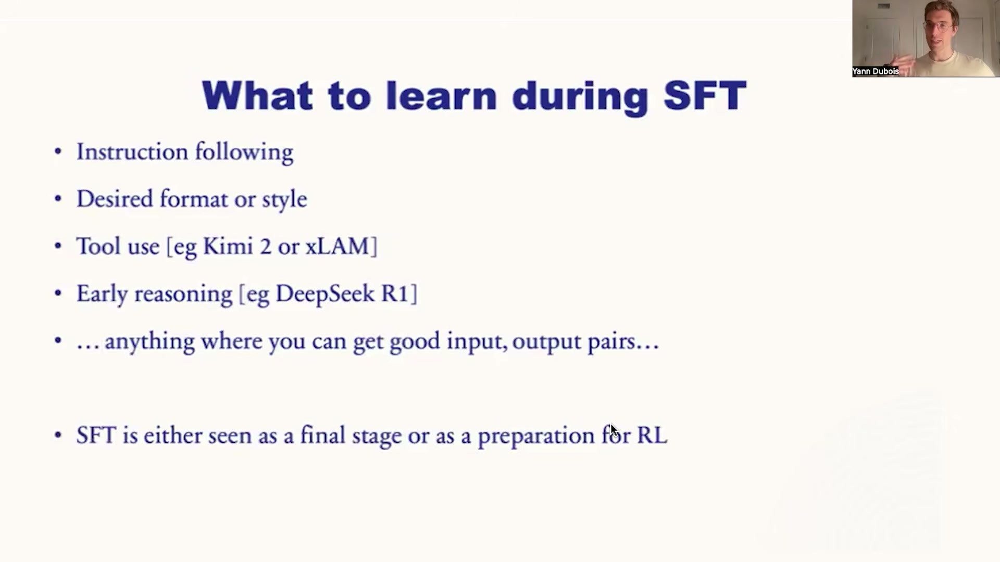

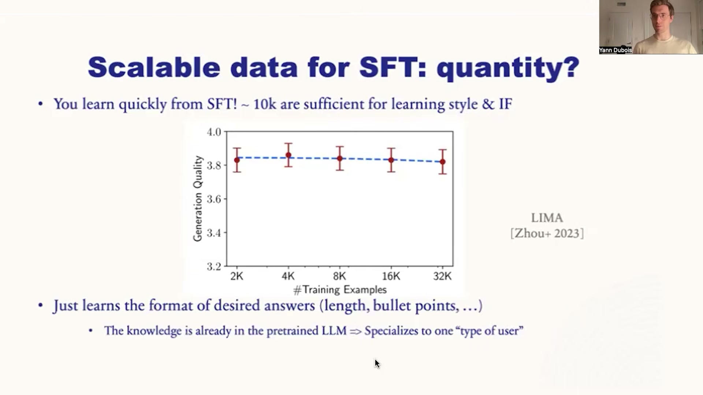

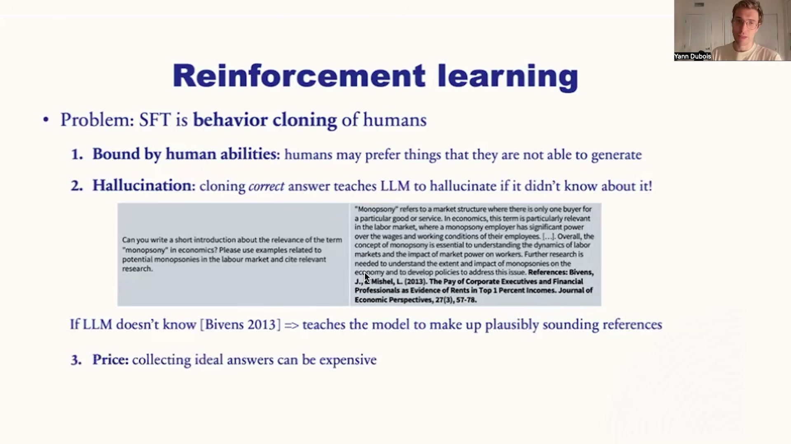

### 本节要点

- SFT 不只影响回答风格，也可以教模型使用工具。
- 不同任务的数据需求不同：简单格式行为可能只需要较少样本，复杂能力需要更多材料。
- 模型可能生成看似合理但并不可靠的内容，因此需要检查机制。
- 代码任务可以通过测试用例构造 verifier。

### 内容讲解

课程把 SFT 的范围从普通问答扩展到工具使用。模型可以学习以特定格式输出、调用工具或完成结构化任务。对于较简单的行为，例如固定的表达形式，少量 SFT 数据就可能产生明显影响；但更复杂的任务仍需要更多数据和更严格的检查。

工具使用截图提示我们，post-training 不是只调整语言风格。模型还需要学习在什么场景下采取什么动作，以及如何按照工具接口或任务约束组织输出。与普通文本回答相比，这类行为更依赖格式正确性和执行结果。

代码任务是 verifier 思路的典型例子。候选代码不是只凭文本风格判断，而是可以运行测试用例检查结果。课程强调，检查逻辑本身也必须与任务一致：如果测试环境或语言假设不正确，verifier 的结论也会失真。

代码验证截图把这个过程落到了具体检查上。模型给出候选答案以后，系统可以运行测试，判断结果是否满足要求。这样得到的反馈更接近任务本身，而不是只看答案是否读起来流畅。

这类机制的价值，在于把部分训练反馈从主观判断转化为可执行的结果检查。

### 小结

当任务存在明确验证条件时，应尽量使用 verifier。它让训练信号更贴近任务结果，而不是停留在表面表达质量上。

---

## 7. 强化学习与训练基础设施

- 时间范围：`01:12:08–01:18:38`

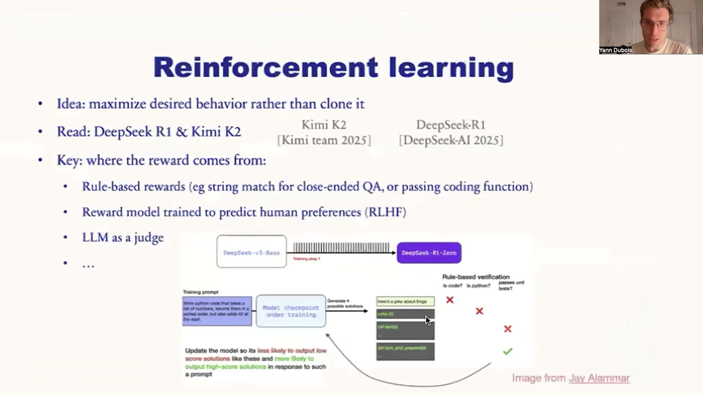

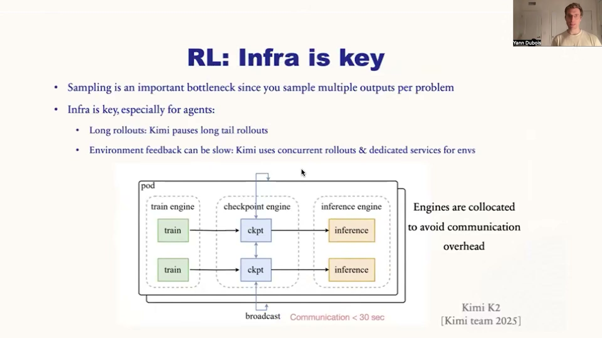

### 本节要点

- verifier 可以为候选结果提供可计算的反馈。
- 训练过程会围绕“通过检查”的结果优化模型。
- 强化学习训练对基础设施要求很高。
- 系统需要协调模型生成、检查、训练和 checkpoint 等环节。

### 内容讲解

有了 verifier，训练过程就可以围绕可检查结果展开：模型生成候选，检查器判断是否满足条件，再把反馈用于优化。课程提到，相关方法会让模型提高通过 verifier 的次数，并把反馈继续传回训练过程。

Verifier 优化截图展示了反馈如何进入训练目标。前一节关注“如何检查”，这一节进一步关注“如何利用检查结果”。当反馈能够稳定计算时，系统就可以围绕结果反复改进模型，而不只是收集静态样本。

这一思路听起来直接，但实际系统并不简单。强化学习训练需要把推理、检查、参数更新和 checkpoint 管理连接起来。课程特别强调 infrastructure 的重要性：算法定义只是其中一部分，系统能否稳定、高效地组织各个步骤同样关键。

训练目标截图对应的是较完整的系统状态。模型生成、结果判断和更新过程彼此依赖，任意一部分吞吐不足或协调失误，都可能拖慢整体训练。因此，本节并不是把强化学习描述成单一公式，而是提醒读者关注端到端执行流程。

从课程主线看，这一节是算法和系统之间的连接点：训练信号已经不再只是原始文本，系统也必须承担更多动态交互。

### 小结

可验证反馈让训练目标更明确，但也提高了系统复杂度。强化学习效果依赖算法与基础设施的共同实现。

---

## 8. 偏好反馈与模型评估

- 时间范围：`01:18:38–01:28:59`

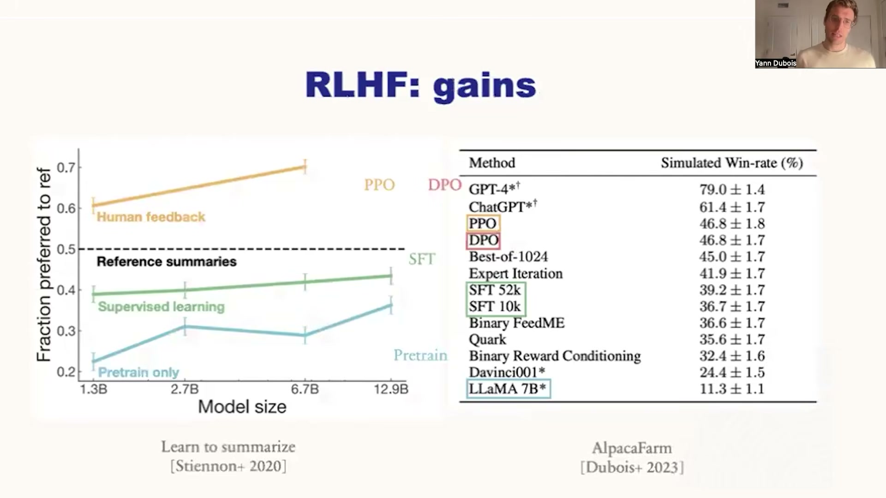

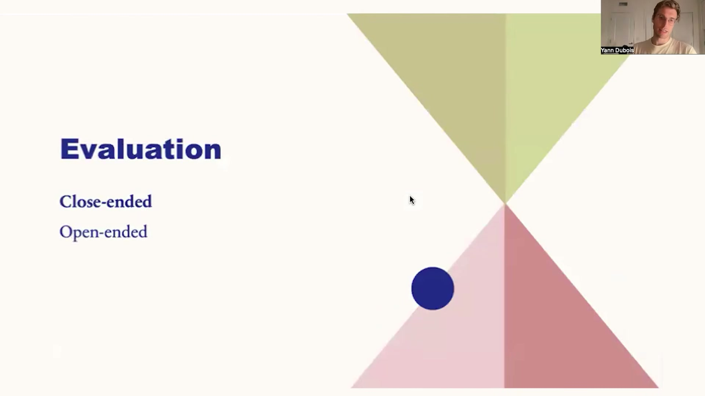

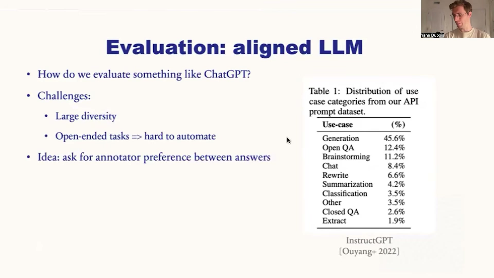

### 本节要点

- 偏好数据可以通过让标注者在多个候选之间进行选择来收集。
- 人类判断会关注内容，也会受到形式、风格和长度影响。
- 评估可以区分为 closed-ended evaluation 和 open-ended evaluation。
- closed-ended 任务需要防止训练测试污染；open-ended 任务通常缺少唯一标准答案。

### 内容讲解

并不是所有任务都能写出一个自动 verifier。对于摘要或开放式回答，可以让标注者比较候选结果，选择更符合需求的答案。这种反馈比单纯模仿文本更贴近实际偏好，但数据收集成本和标注标准会直接影响结果。

偏好反馈截图展示了这种比较式数据收集方式。与代码测试不同，这里的判断不一定能完全自动化。标注者需要在候选之间进行选择，而选择结果会反过来影响模型学习什么样的回答形式和内容组织。

课程随后把评估分为两类。closed-ended evaluation 通常存在明确答案，因此更容易统计正确率，但需要警惕训练数据与评估数据重叠。open-ended evaluation 更贴近实际交互，却常常没有唯一 gold answer，需要通过人类比较或其他评估设计来判断质量。

两张评估截图可以配合阅读：一张用于建立分类框架，另一张强调开放式评估的难点。一个模型在有标准答案的任务上表现良好，并不自动意味着它在开放式使用中也同样可靠；反过来，开放式偏好也不能替代对明确能力的检查。

这两类评估不能互相替代。前者适合检查明确能力，后者适合观察真实使用体验。

### 小结

评估方法必须匹配任务性质。可判定任务重视答案正确性与数据隔离，开放式任务重视比较标准和人类判断质量。

---

## 9. 推理效率：计算、内存层级与编译优化

- 时间范围：`01:28:59–01:45:09`

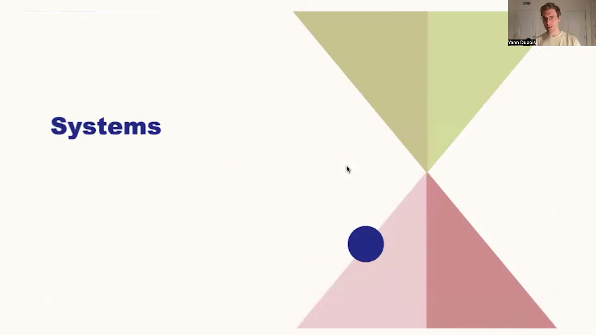

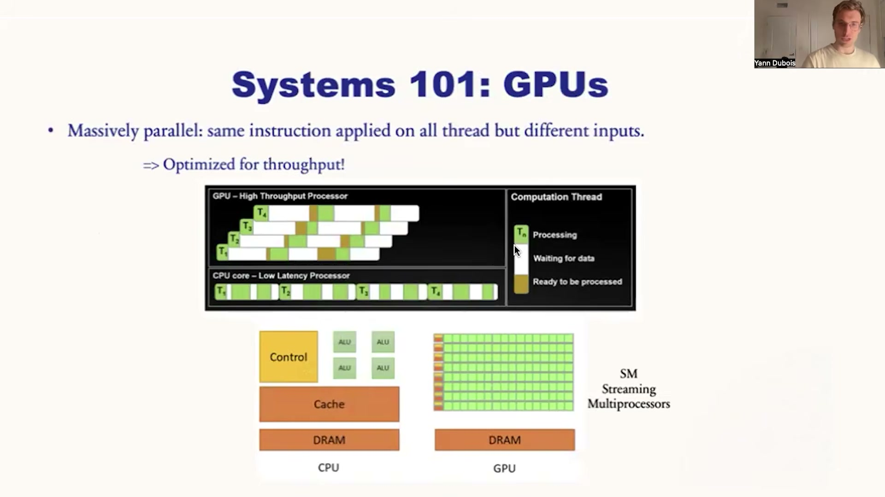

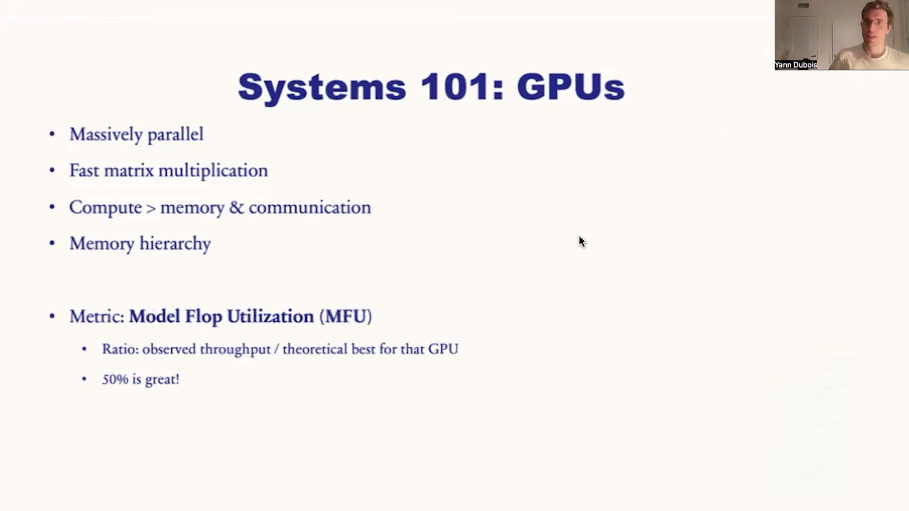

### 本节要点

- 系统效率取决于计算资源分配和执行 pipeline。
- 矩阵乘法是重要计算环节，但运行速度也会受到数据移动影响。
- 越靠近计算核心的存储访问通常越快。
- 编译和算子调度可以通过减少慢速访问、提高数据复用来改善效率。

### 内容讲解

模型训练和推理不能只看理论计算量。课程先讨论资源分配和 pipeline 优化，再把注意力转向矩阵乘法与内存层级。即使主要计算发生在矩阵运算中，实际速度仍会受到数据读取、写回和不同存储层级之间移动的限制。

资源分配和矩阵计算截图说明，系统效率问题需要分层理解。上层要安排 pipeline 和工作负载，下层要关注具体计算是否能够充分利用硬件。如果只优化其中一层，整体速度仍可能受另一层限制。

因此，优化目标不仅是“做更少的计算”，还包括“更合理地安排计算顺序”。课程提到 `torch.compile`、线程组织、缓存复用以及减少慢速数据访问。它们共同指向同一原则：尽量让已经读取的数据被更充分地使用。

内存层级截图进一步解释了为什么数据移动如此重要。不同位置的数据访问成本不同，越接近计算核心，通常越适合被频繁使用。优化执行顺序的目的之一，就是减少反复从较慢位置搬运相同数据。

约 `01:34:50` 附近的局部材料可能不完整。这一处关于运行效率的细节可结合原视频进一步复核，但不影响本节的主线：计算安排和数据复用需要一起考虑。

### 小结

系统效率既受计算量影响，也受内存访问影响。优化执行顺序和数据复用，是把硬件能力转化为实际速度的关键。

---

## 10. 并行策略：在多设备之间分配模型与数据

- 时间范围：`01:45:09–01:56:52`

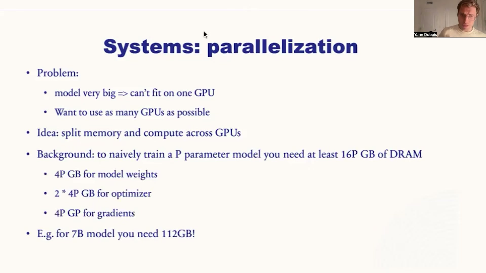

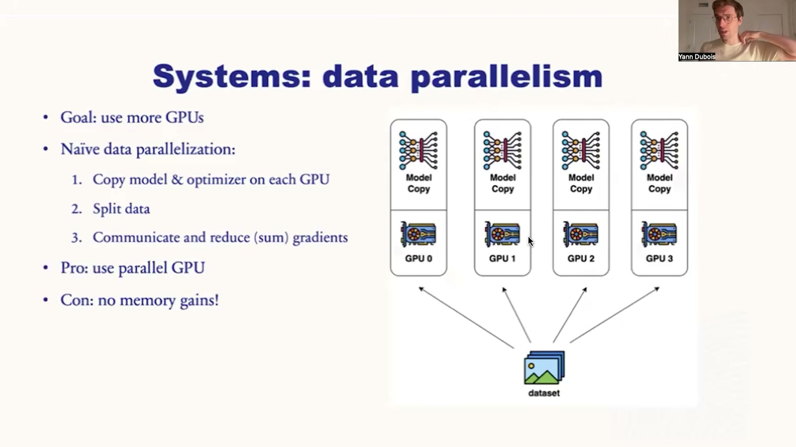

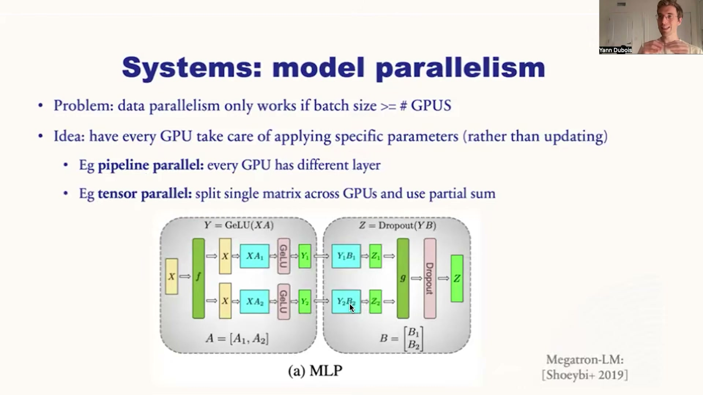

### 本节要点

- 大模型训练需要认真估算参数、梯度和优化过程带来的内存占用。
- 课程用与参数规模 `P` 相关的内存估算说明问题，其中包含 `16P` GB 级别的 DRAM 需求表达。
- 仅做数据并行不一定带来单设备内存收益。
- 可以把权重、层或矩阵切分到不同设备上。

### 内容讲解

当模型变大以后，单个设备很难独立保存全部训练状态。课程先用参数规模 `P` 相关的估算说明内存压力，再讨论并行化策略。这里需要区分两类目标：一类是提高吞吐，另一类是降低每个设备承担的内存负担。

并行化截图对应这一问题的起点：模型规模增长以后，需要把工作分配到多个设备。设备数量增加并不意味着问题自动解决，因为不同分配方式会改变内存占用、通信量和执行组织。

数据并行让不同设备处理不同数据子集，但每个设备仍可能需要保存完整模型，因此不一定减少模型内存。进一步的切分策略会让设备只持有部分权重、部分层或矩阵的一部分。这样可以处理更大的模型，但也会引入新的通信和协调成本。

权重分配和矩阵切分截图展示了更细的划分方式。读者不必在这一节记住所有实现细节，但需要区分两种思路：一种是复制模型、拆分数据；另一种是拆分模型本身。前者侧重吞吐，后者能够缓解单设备内存压力。

课程在这里再次回到工程权衡。切分得越细，设备之间越需要交换信息。系统设计的目标不是单纯追求更多设备，而是在模型规模、内存限制和通信成本之间找到可运行的组合。

### 小结

并行化不是单一技巧。选择策略时，需要同时考虑吞吐、设备内存和通信成本。

---

## 11. 总结：训练 pipeline 与工程权衡

- 时间范围：`01:56:52–01:58:20`

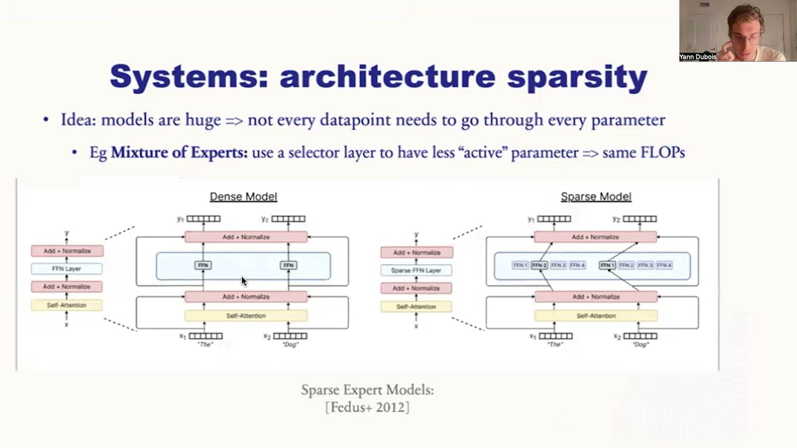

### 本节要点

- 大语言模型能力来自多阶段 pipeline，而不是单一算法。
- 数据、训练方法、评估和系统实现需要配合。
- tiling 和操作顺序等底层优化会影响实际效率。

### 内容讲解

课程结尾回到系统视角。前面的内容从预训练数据一路延伸到 post-training、verifier、评估、内存和并行策略，说明大语言模型训练是一项跨层工程。模型效果、资源消耗和运行效率之间始终存在权衡。

总结截图把课程拉回到整体 pipeline。数据决定模型能够接触什么，训练目标决定模型如何吸收反馈，系统实现决定这些步骤能否在可接受的资源范围内完成。任何一个环节都不能脱离其他环节单独评价。

学习这套流程时，可以把问题分成三层：模型要学习什么，训练信号如何获得，系统如何把训练和推理高效执行。只有把三层放在一起，才能理解真实项目中的决策。

课程最后提到 tiling 和操作顺序，这与前面的内存层级讨论形成呼应。即使已经确定模型和训练方法，底层执行方式仍会影响实际效率。对学习者而言，重要的是建立跨层视角，而不是把算法和系统割裂开来。

### 小结

大语言模型工程的核心能力，是在数据、算法和系统约束之间做可解释的取舍。
