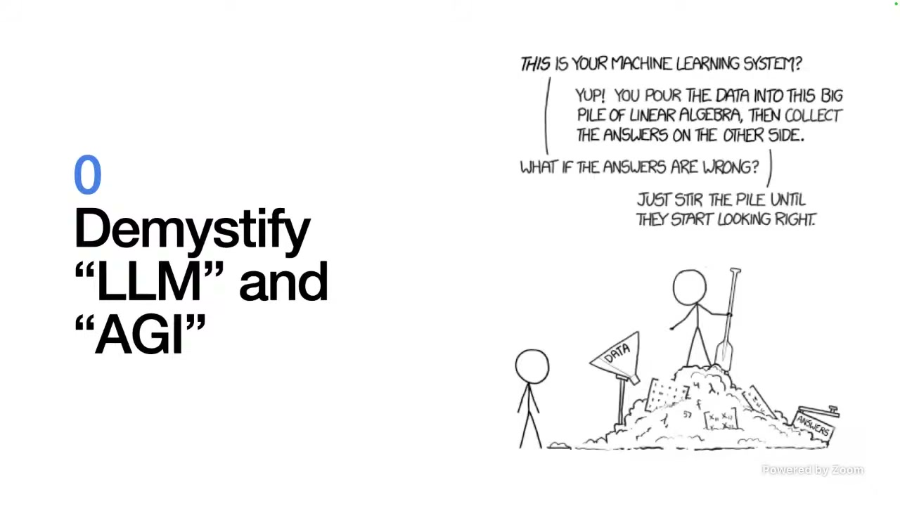
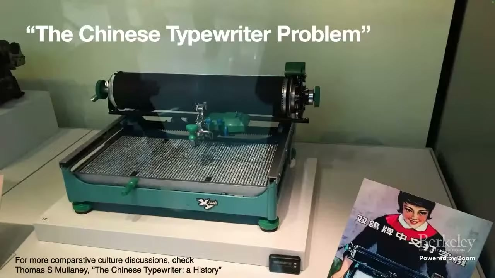
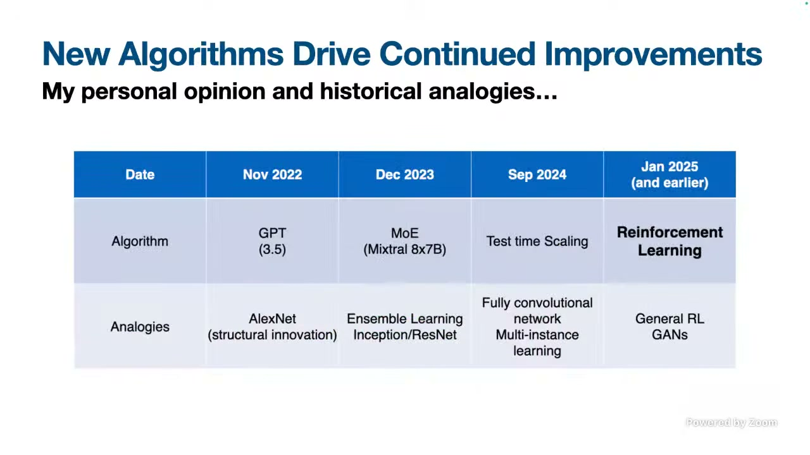
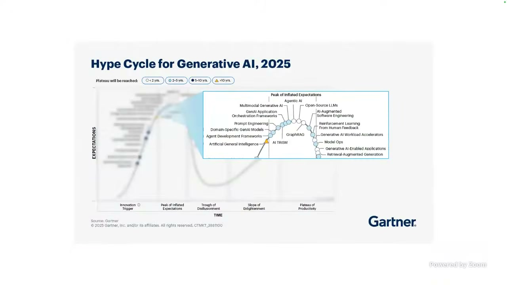
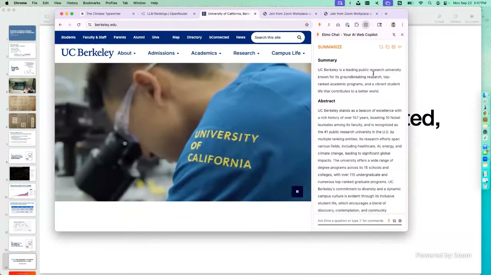
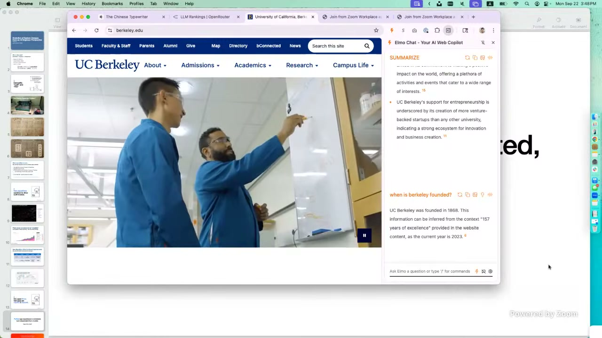
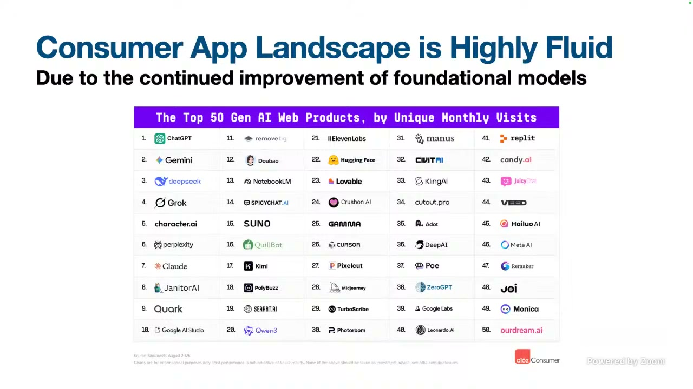
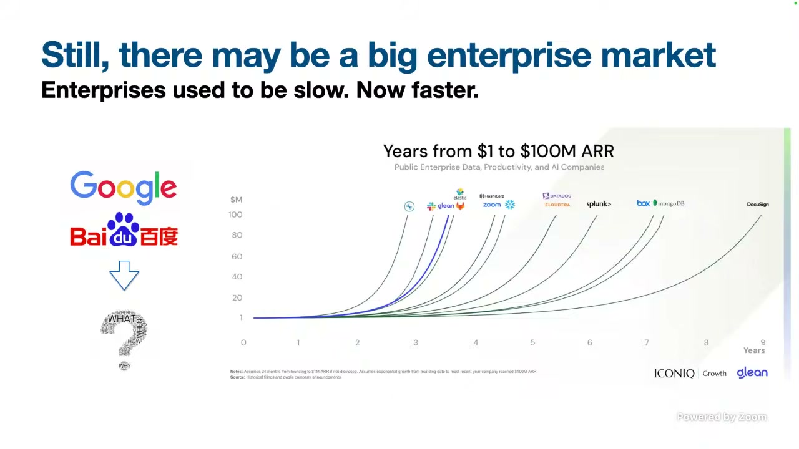
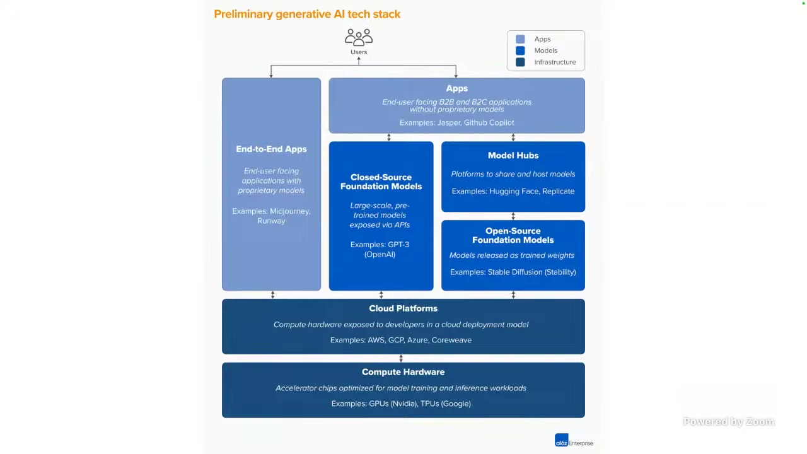

# 课程讲义骨架：lesson2

> 本文件是机器生成的讲义骨架草稿，尚未经过人工审核，也不是最终润色后的课程讲义。

## 课程概览

- 运行标识：`lesson2`
- 内容来源：公开视频字幕与视频关键截图。
- 原始字幕语言：`en-j3PyPqV-e1s`
- 当前版本用于核对内容结构、时间范围和代表截图。
- 字幕摘录保留原始语言，后续需要基于可追溯证据整理为自然中文讲义。

## 章节 001

### 教学单元 001

- 时间范围：00:00:01 - 00:00:30
- 当前状态：待后续内容整理与人工复核。

字幕摘录（原文，供后续整理）：

- And like Dom said, I'm actually one of our own.
- and we didn't really have that fancy building
- What is his thought process and things like that.

### 教学单元 002

- 时间范围：00:00:30 - 00:02:08
- 当前状态：待后续内容整理与人工复核。

字幕摘录（原文，供后续整理）：

- Back at Berkeley days, and then my first job back at Google,
- newer, larger, and more real-world
- about when they are doing a startup and model

### 教学单元 003

- 时间范围：00:02:08 - 00:03:29
- 当前状态：待后续内容整理与人工复核。

字幕摘录（原文，供后续整理）：

- and applications and things like that I would like to basically
- My home language is Chinese.
- and things like that, you know that Chinese characters don't

### 教学单元 004

- 时间范围：00:03:29 - 00:04:59
- 当前状态：待后续内容整理与人工复核。

字幕摘录（原文，供后续整理）：

- really show up on the keyboard.
- A huge keyboard.
- and things like that, the idea is

## 章节 002

### 教学单元 005

- 时间范围：00:04:59 - 00:06:19
- 当前状态：待后续内容整理与人工复核。

字幕摘录（原文，供后续整理）：

- that the distance between the current character
- And people were like, how do we actually group things
- The words that are basically like the characters that

### 教学单元 006

- 时间范围：00:06:19 - 00:08:40
- 当前状态：待后续内容整理与人工复核。

字幕摘录（原文，供后续整理）：

- happen together gets grouped together so
- before it and after it, how do we predict the current word?
- So a lot of these basic ideas come in similar ways, of course,

### 教学单元 007

- 时间范围：00:08:40 - 00:10:29
- 当前状态：待后续内容整理与人工复核。

字幕摘录（原文，供后续整理）：

- with more sophisticated and powerful models.
- And in the end, I want to basically talk a little bit
- and a dude with too much code kind of perspective.

### 教学单元 008

- 时间范围：00:10:29 - 00:12:40
- 当前状态：待后续内容整理与人工复核。

字幕摘录（原文，供后续整理）：

- So just similar to what we were just talking about, I mean,
- itself as well.
- And the next question is people often ask is like,

## 章节 003

### 教学单元 009

- 时间范围：00:12:40 - 00:15:00
- 当前状态：待后续内容整理与人工复核。

字幕摘录（原文，供后续整理）：

- there's quite a bunch of modules,
- of something around sorry 50 billion to 60 billion tokens
- So apparently, there's a continued growth of consumption

### 教学单元 010

- 时间范围：00:15:00 - 00:18:59
- 当前状态：待后续内容整理与人工复核。

字幕摘录（原文，供后续整理）：

- which actually gives us hope that AI this round has actually
- and I'll refrain from diving deep into that.
- Reinforcement learning allows us to basically say

### 教学单元 011

- 时间范围：00:18:59 - 00:20:29
- 当前状态：待后续内容整理与人工复核。

字幕摘录（原文，供后续整理）：

- a model should basically do some rollout or predictions,
- normally look at, you can see that a lot of the ideas
- It continues to be, but it seems that now everyone

### 教学单元 012

- 时间范围：00:20:29 - 00:22:21
- 当前状态：待后续内容整理与人工复核。

字幕摘录（原文，供后续整理）：

- is talking about agents.
- how hard is it to make an application that's an API,
- So over two days-- basically, he was a very smart front end

## 章节 004

### 教学单元 013

- 时间范围：00:22:21 - 00:23:30
- 当前状态：待后续内容整理与人工复核。

字幕摘录（原文，供后续整理）：

- engineer.
- And I can basically ask questions like, when is--
- skills and a powerful LLM model we'll

### 教学单元 014

- 时间范围：00:23:30 - 00:25:48
- 当前状态：待后续内容整理与人工复核。

字幕摘录（原文，供后续整理）：

- be able to do something that's way more efficient than we could
- by Berkeley grad student.
- We also see that models such as basically, I think, ElevenLabs

### 教学单元 015

- 时间范围：00:25:48 - 00:26:09
- 当前状态：待后续内容整理与人工复核。

字幕摘录（原文，供后续整理）：

- having its own model, and then Midjourney having its own model
- But in general, it's like a blue ocean kind of field,
- And one thing that we are seeing is there's a lot of traffic,

### 教学单元 016

- 时间范围：00:26:09 - 00:28:58
- 当前状态：待后续内容整理与人工复核。

字幕摘录（原文，供后续整理）：

- but who are willing to pay?
- multi-hundred million revenues.
- So when we think about enterprises,

## 章节 005

### 教学单元 017

- 时间范围：00:28:58 - 00:32:39
- 当前状态：待后续内容整理与人工复核。

字幕摘录（原文，供后续整理）：

- things are in an interesting position
- So, I think, basically, when we think about the potential of AI,
- and experience.

### 教学单元 018

- 时间范围：00:32:39 - 00:33:39
- 当前状态：待后续内容整理与人工复核。

字幕摘录（原文，供后续整理）：

- So I think this basically it's going to be continuing,
- to build and to scale the next generation models
- And when I say the third pillar, what are the pillars that we're

### 教学单元 019

- 时间范围：00:33:39 - 00:37:38
- 当前状态：待后续内容整理与人工复核。

字幕摘录（原文，供后续整理）：

- talking about?
- And what they need is basically we host a bunch of machines.
- In the old days, in web compute, there's quite a lot of IO.

## 章节 006

### 教学单元 020

- 时间范围：00:37:38 - 00:41:35
- 当前状态：待后续内容整理与人工复核。

字幕摘录（原文，供后续整理）：

- We moved data around web pages, images, and things like that.
- days no longer holds, because conventional cloud-based data
- and you cannot really run a web service on top of GPUs,

### 教学单元 021

- 时间范围：00:41:35 - 00:45:34
- 当前状态：待后续内容整理与人工复核。

字幕摘录（原文，供后续整理）：

- so interchangeability becomes harder.
- mainly because Kubernetes is a very nice abstraction,
- So basically we're thinking about this.

### 教学单元 022

- 时间范围：00:45:34 - 00:49:32
- 当前状态：待后续内容整理与人工复核。

字幕摘录（原文，供后续整理）：

- I had to basically use Lepton as like a bullshitting marketing
- coding models.
- a certain amount of traffic coming in,

## 章节 007

### 教学单元 023

- 时间范围：00:49:32 - 00:53:28
- 当前状态：待后续内容整理与人工复核。

字幕摘录（原文，供后续整理）：

- gradually putting the services up to speed.
- like that really well.
- for permission.

### 教学单元 024

- 时间范围：00:53:28 - 00:57:27
- 当前状态：待后续内容整理与人工复核。

字幕摘录（原文，供后续整理）：

- It operates very much like a mainframe with all those CPUs
- for training and inference, which is really nice.
- And if you read the news, you know that since the Reagan days,

### 教学单元 025

- 时间范围：00:57:27 - 01:01:25
- 当前状态：待后续内容整理与人工复核。

字幕摘录（原文，供后续整理）：

- there is a growing shortage, a continued
- Hopefully, some of the materials will be interesting to you.
- But I think as we get more and more mature in the engineering

## 章节 008

### 教学单元 026

- 时间范围：01:01:25 - 01:05:24
- 当前状态：待后续内容整理与人工复核。

字幕摘录（原文，供后续整理）：

- operations and care more about the efficiency and productivity
- going to be losing money for many years,
- It was my anniversary, basically.

### 教学单元 027

- 时间范围：01:05:24 - 01:09:24
- 当前状态：待后续内容整理与人工复核。

字幕摘录（原文，供后续整理）：

- I was basically asking OpenAI, I was like,
- mainly because, I think, in theory, the model
- abstracted away as replaceable individual virtual machines,

### 教学单元 028

- 时间范围：01:09:24 - 01:13:22
- 当前状态：待后续内容整理与人工复核。

字幕摘录（原文，供后续整理）：

- and their exact physical location in the racks
- So it's not a failure story.
- And engineers see me as a friend,

## 章节 009

### 教学单元 029

- 时间范围：01:13:22 - 01:17:22
- 当前状态：待后续内容整理与人工复核。

字幕摘录（原文，供后续整理）：

- as well, because they see that I've done sysadmin in the past
- versus more needed edge compute, distributed
- like a robot or a phone.

### 教学单元 030

- 时间范围：01:17:25 - 01:19:27
- 当前状态：待后续内容整理与人工复核。

字幕摘录（原文，供后续整理）：

- I will basically say it hasn't been
- such a shortage of GPUs, and GPUs
- So that was one of the big problems that we encountered.

## 后续整理说明

当前文件仅提供可追溯的章节骨架、截图和有限字幕摘录。自然中文表达、概念归并和示例整理将在后续阶段完成。
