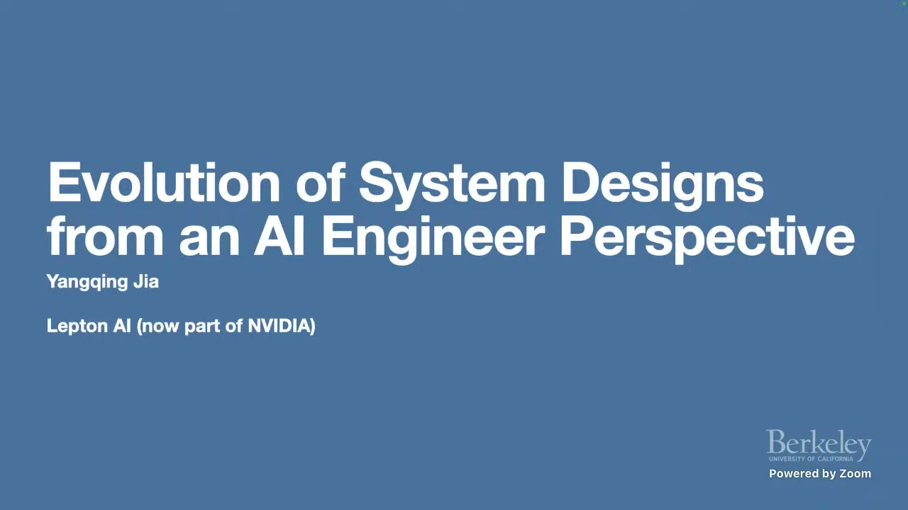
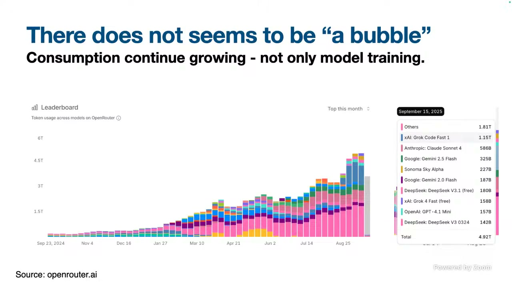
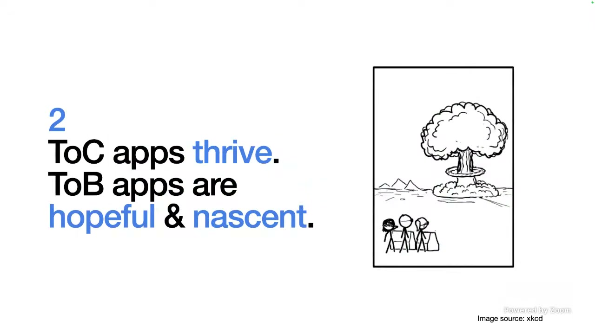
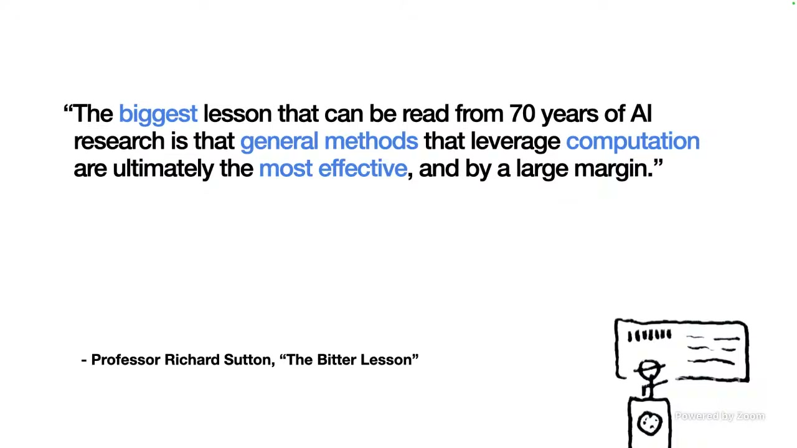

# 从语言模型到 AI 基础设施：系统设计为何正在变化

本讲义根据课程视频字幕、关键截图与时间轴整理而成，保留时间范围，便于回看原视频对应片段。

本课从一个看似古老的问题出发：中文打字机如何安排数千个汉字，才能减少机械移动距离？讲者借此说明，许多今天看起来神秘的 AI 能力，仍可以从计算机科学中的基础思想出发理解。课程随后逐层展开：模型为何持续进步，应用如何创造价值，AI workload 为什么改变云基础设施，以及硬件设计为何重新呈现出大型机时代的特征。

## 1. 从研究者经历到系统设计问题

- 时间范围：`00:00:01 - 00:02:09`

### 代表截图

### 本节要点

- 讲者的经历横跨 AI 研究、框架工程和云基础设施。
- AI workload 与传统微服务、数据库和数据分析 workload 有明显差异。
- 本课关注的是应用和系统视角，而不是模型数学推导。

### 内容讲解

讲者先回顾了自己从 Berkeley、Google 到创业公司的经历。他参与过 GoogLeNet / Inception，也开发过 Caffe，并参与 TensorFlow 和 PyTorch 相关工作。这条经历让他持续观察到一个变化：AI 不只是增加了一类新算法，它还改变了工程系统需要优化的对象。

传统互联网服务常围绕微服务、数据库和数据分析组织。AI 系统则需要面对更大的模型、更密集的计算、更昂贵的硬件，以及训练和推理中的新型可靠性问题。因此，原有云计算经验仍然重要，但不能直接照搬。

这门课采用 outside-in 的方式展开。它不追求逐项解释模型公式，而是讨论产业中真实出现的问题：模型是否有实际使用量，哪些应用愿意付费，AI 基础设施与传统云有什么差别，以及硬件演化如何反过来影响软件设计。

### 小结

理解 AI 系统设计，不能只看模型能力。更有效的学习路径是同时观察算法、应用、基础设施和硬件之间的相互制约。

## 2. 中文打字机：预测问题的早期形态

- 时间范围：`00:02:09 - 00:05:00`

### 代表截图

### 本节要点

- 中文打字机需要在数千个常用汉字之间移动机械部件。
- 常一起出现的字符如果放得更近，输入效率会显著提高。
- 统计字符组合，本质上是在利用上下文预测下一步。

### 内容讲解

英文键盘可以把字母直接映射到按键。中文打字机面对的是另一种问题：常用字符数量远超键盘按键数量，早期机械设备需要在大型字盘上寻找并拾取字符。输入速度不仅取决于操作熟练度，也取决于字符在字盘上的空间布局。

如果两个字符经常连续出现，把它们放在更近的位置，就能减少机械臂移动距离。讲者把这个问题类比为旋转硬盘上的寻道：相关数据如果相邻存放，访问成本会降低。优化字盘和整理磁盘看似不同，背后都在减少移动代价。

改进方法并不神秘。研究者统计字符共同出现的频率，也就是今天熟悉的 bigram 和 n-gram，再根据高频组合调整布局。统计规律帮助系统猜测接下来更可能出现什么，从而提高整体效率。

### 小结

语言预测不是突然出现的新问题。早期中文打字机已经展示了核心直觉：上下文中的共现关系可以转化为更高效的决策。

## 3. 从 n-gram 到 next-token prediction

- 时间范围：`00:05:00 - 00:12:40`

### 代表截图

### 本节要点

- n-gram 使用有限长度的历史统计预测后续字符。
- BERT 利用前后文恢复当前位置，GPT 类模型主要根据历史预测下一个 token。
- 现代模型扩大了可利用的上下文范围，并将知识压缩到预测任务中。

### 内容讲解

讲者将字盘布局进一步连接到现代语言模型。在早期统计方法中，系统只能计算很短的上下文，例如前面两三个字符。随着上下文长度增加，相关矩阵会迅速膨胀，人工设计和显式统计越来越困难。

现代模型仍然保留了预测的基本形式。BERT 的典型任务是根据前后文恢复被遮盖的词；GPT 类模型则主要沿着历史序列预测下一个 token。二者的训练方式不同，但都把语言理解转化为基于上下文的推断。

重要变化在于规模。过去只能处理有限的 n-gram，现在模型可以利用长得多的上下文。讲者强调，这种简单目标在足够大的数据、模型和计算量支持下，可以吸收大量隐含知识。

课程在这里给出一个学习方法：面对新的 AI 名词，先寻找它与已有计算机科学概念的联系。新系统往往并不是完全脱离旧经验，而是把旧原则扩展到了新的规模。

### 小结

next-token prediction 的目标很简洁，但规模化之后会产生丰富能力。理解这一点，有助于把模型能力放回可分析的工程框架中。

## 4. 模型使用量与持续演化

- 时间范围：`00:12:40 - 00:22:21`

### 代表截图

### 本节要点

- 判断市场是否只是泡沫，需要观察实际使用量，而不只是训练投入。
- OpenRouter 等聚合渠道提供了模型消费变化的侧面证据。
- 模型演化包括结构创新、稀疏化、test-time scaling 和强化学习等方向。

### 内容讲解

讲者先讨论了一个常见疑问：产业是否只是在不断训练模型，却没有真实消费？他的建议是引入可观察指标。例如，聚合不同模型调用的渠道可以显示 token 使用量变化，以及开源模型和闭源模型之间的竞争格局。

截图展示了模型消费量持续增长的趋势。它不能代表整个市场，但至少提供了一种比新闻标题更接近实际使用情况的观察方法。课程希望学生建立这种习惯：讨论产业趋势时，优先寻找可量化证据。

模型能力也不是沿着单一路线提升。讲者把近期演化类比到过去的机器学习发展：结构变化可以提高参数利用效率；Mixture of Experts 使用稀疏激活；test-time scaling 允许模型在推理阶段投入更多计算；强化学习则把任务反馈带入训练和推理流程。

这些变化共同说明，AI 的进展不仅来自“把模型做大”。结构、训练方法、推理预算和数据使用方式都在持续调整。系统设计必须为这种快速变化保留空间。

### 小结

模型市场有实际消费支撑，算法路线也仍在演进。工程决策应同时观察使用量和技术变化，而不是只依据单一叙事。

## 5. 应用市场：ToC 活跃，ToB 正在形成

- 时间范围：`00:22:21 - 00:32:39`

### 代表截图

### 本节要点

- 通用模型显著降低了构建应用原型的成本。
- 消费级应用竞争激烈，产品格局变化很快。
- 愿意为生产力提升付费的 prosumer 是重要市场。
- 企业应用增长可观，但需要跨越流程、权限和系统集成门槛。

### 内容讲解

讲者用一个网页总结应用说明，模型能力可以与普通编程技能结合，在很短时间内构建过去难以完成的功能。应用能够读取网页、生成摘要并回答问题。重点不是某个具体产品，而是开发门槛发生了变化。

消费级市场中，聊天、编程、搜索和多媒体创作都是活跃方向。竞争同样激烈：底层模型能力提升后，缺乏差异化的应用可能很快被替代。应用需要理解用户、嵌入工作流，或者拥有独特模型和数据能力。

截图中的判断是：ToC 应用已经表现活跃，ToB 应用仍处于早期但值得期待。专业消费者愿意为生产力付费，例如编程工具、创意工具、会议记录和语音服务。这里的付费意愿来自工作价值，而不是单纯的新奇体验。

企业市场的节奏不同。组织内部有既有系统、数据权限、审批流程和责任边界。模型能力只是起点，真正落地还需要集成、可控性和对业务流程的理解。

### 小结

应用层的机会并不等于简单包装模型。可持续价值来自具体工作流、用户理解和组织约束中的落地能力。

## 6. 企业落地与计算驱动的方法

- 时间范围：`00:32:39 - 00:37:38`

### 代表截图

### 本节要点

- 企业采用速度正在提高，但长期价值仍需要实际业务结果证明。
- 通用、可扩展并能利用计算的方法往往比手工规则更有生命力。
- AI 系统需要把模型能力转化为可维护的服务。

### 内容讲解

讲者讨论企业市场时，强调了 adoption 的两面性。一方面，企业应用正在比过去更快进入组织流程；另一方面，企业客户不会只为模型演示付费。他们关心权限、数据、稳定性、成本和责任分配。

截图引用了 Richard Sutton 的 “The Bitter Lesson”：能够利用计算的一般方法，长期往往比依赖大量人工规则的方法更有效。它与课程开头的预测类比相呼应。规则并非没有价值，但系统需要为规模增长留下空间。

企业落地因此不是“接入一个模型接口”这么简单。团队需要把模型能力嵌入可靠服务，处理数据访问、错误恢复、用户体验和成本控制。工程能力会成为差异化的一部分。

### 小结

企业 AI 的价值需要通过系统化落地实现。通用方法与工程约束必须同时考虑，才能从演示走向可持续服务。

## 7. 为什么 AI Infra 不等于传统云

- 时间范围：`00:37:38 - 00:49:32`

### 代表截图

本章后半段缺少新的高价值代表截图。建议回看原视频对应时间范围，并在人工验收时检查是否需要补充视觉证据。

### 本节要点

- Web workload、数据 workload 和 AI workload 的瓶颈不同。
- AI workload 更偏向密集计算，对 GPU 集群和高速网络依赖更强。
- 大规模训练中的单机故障可能影响整个作业。
- 面向 AI 的 neocloud 因此出现。

### 内容讲解

传统 Web 服务通常重视 IO 和弹性扩缩容。一个微服务可以复制多个实例，流量下降时再释放资源。数据分析系统则需要更复杂的分布式调度，但 MapReduce 和 Spark 等抽象允许失败任务重新执行。

AI workload 更偏向密集数值计算。模型训练需要大量 GPU 协同工作，高性能网络也成为关键部分。当一个节点失败时，损失可能不只是一个小任务，而是整个分布式训练作业的进度。

这使传统云的部分价值主张发生变化。AI 软件栈相对集中，但硬件供给更刚性，GPU 资源也更难像普通 CPU 实例那样灵活互换。系统设计必须更重视集群拓扑、资源组合和故障恢复。

讲者据此介绍 neocloud：一些服务商专注于聚合 GPU 和提供 AI 计算资源，而不是复制传统云的全部数据库和应用服务。它们试图围绕 AI workload 重新设计产品。

### 小结

AI Infra 的核心不是把传统云换成 GPU。工作负载特征改变后，资源组织、调度方式和可靠性模型都需要重新思考。

## 8. 硬件设计回到大型机式整合

- 时间范围：`00:49:32 - 01:01:25`

### 代表截图

本章缺少新的高价值代表截图。原视频包含 Cray、DGX 和 rack-level 系统的讲解，建议在人工验收时补充截图。

### 本节要点

- 云时代强调小型、模块化服务器。
- AI 服务器逐步从单机走向机架级整合。
- 高带宽互联让多个计算单元更像共享资源的大型系统。
- 软件栈仍需要适应新的硬件抽象。

### 内容讲解

讲者从 Cray 2 大型机谈起。早期系统倾向于把 CPU、内存和互联看成一个整体，编程体验统一，但灵活性有限。互联网云时代则转向模块化小服务器，以便独立替换和扩缩容。

AI 让硬件再次变大。DGX 类服务器在一个机箱中集成多个 GPU 和 CPU，面向高密度模型训练与推理。随后，系统进一步扩展到 rack-level 设计，把多个计算节点通过高带宽交换网络紧密连接。

新的互联模式弱化了单机边界。多个计算单元能够更直接地访问资源，系统在某些方面重新接近大型机或高性能计算环境。模型部署、缓存和分布式优化也会受到影响。

但硬件变化并不会自动转化为软件效率。框架、调度器和运行时仍需要理解新的拓扑和共享方式。这里存在大量工程探索空间。

### 小结

硬件演化呈现出一种回环：从大型机到模块化云服务器，再到面向 AI 的机架级整合。软件系统必须跟随这种变化重新设计抽象。

## 9. 成本、RAG、创业方向与边缘计算

- 时间范围：`01:01:25 - 01:19:27`

### 代表截图

本章为问答与延伸讨论，缺少新的高价值代表截图。建议结合时间范围回看原视频。

### 本节要点

- 当前 token 经济性仍有压力，但单位能力成本持续下降。
- RAG 没有消失，而是逐渐成为默认系统组件。
- 创业团队更适合结合领域知识解决垂直问题。
- 集中式大集群与边缘侧高效推理会长期并存。

### 内容讲解

课程最后进入问答。首先是 token 成本与价格的问题：一些应用收费尚不足以覆盖模型调用成本。讲者认为，早期产业允许一定程度的低效，只要产品确实创造价值，并且相同能力的成本能够持续下降。

随后讨论 RAG。新名词不断出现，但检索和排序仍然重要。更成熟的系统通常先用成本较低的方法做粗筛，再用更强模型做精排和回答。数据库和搜索不再总是被单独强调，不代表它们失去价值。

对于创业方向，讲者不建议多数团队直接训练新的基础模型。更现实的机会是结合领域知识、用户流程和新模型能力，解决大型平台不会投入足够精力处理的垂直问题。差异化来自对场景的理解和执行速度。

最后，讨论从大集群走向边缘计算的另一条路线。训练和高端推理仍需要集中式资源，但机器人、手机和边缘节点要求更高效的模型。随着应用成熟，成本、时延和部署位置会越来越重要。

讲者还提到，真实创业中的难题未必是算法本身。GPU 短缺、采购合同和资源供给同样会消耗大量精力。AI 系统设计最终必须面对技术与供应链的共同约束。

### 小结

AI 系统的下一阶段不会只有一条路线。成本优化、检索增强、垂直应用、边缘部署和供应链管理，都会影响产品能否真正落地。

## 课程总结

这节课的核心不是追逐单个模型名词，而是建立一套观察 AI 系统的方法：

- 从基础预测问题理解语言模型。
- 用真实消费数据观察市场，而不是只看训练热度。
- 在应用层区分演示、工作流和可持续价值。
- 在基础设施层识别 AI workload 与传统云的差异。
- 在硬件层关注机架级整合和软件抽象变化。
- 在产品决策中同时考虑成本、可靠性、部署位置和供应链。

当模型能力快速变化时，最稳健的策略是保留可追溯证据，并持续检查算法、系统和商业价值是否仍然匹配。
